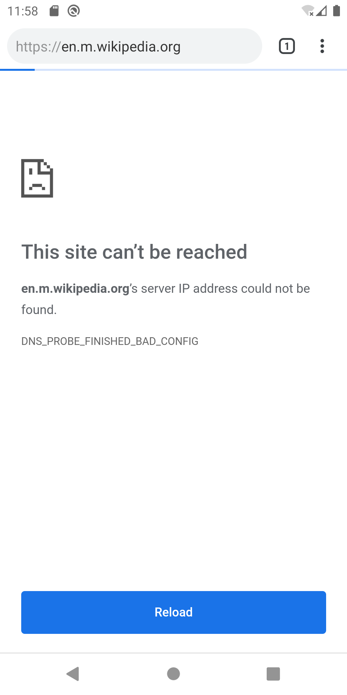

# Android Virtual Device DNS 관련 네트워크 문제 해결

* AVD로 개발하던 와중에 갑자기 아래와 같은 화면처럼 에뮬레이터에서 네트워크가 정상 작동하지 않는 문제가 있었다.


* 문제 원인을 파악하기 위해 Android Emulator 네트워킹 설정 문서를 먼저 일부 정리해보았다.


## Android emulator 네트워킹
https://developer.android.com/studio/run/emulator-networking?hl=ko

에뮬레이터의 각 인스턴스는 가상라우터/방화벽 서비스 뒤에서 실행된다.

각 인스턴스의 가상 라우터는 10.0.2/24 네트워크 주소공간을 관리한다. 형식은 10.0.2.xx
* 10.0.2/24 주소 공간에서 미리 할당되는 네트워크 주소
    * 10.0.2.1 - 라우터/게이트웨이 주소
    * 10.0.2.2 - 호스트 루프백 인터페이스의 특수 별칭 (개발 머신의 127.0.0.1)
    * 10.0.2.3 - 첫 번째 dns 서버
    * 10.0.2.4/10.0.2.5/10.0.2.6 - 두 번째, 세 번째, 네 번째 DNS 서버(선택사항, 있는 경우)
    * 10.0.2.15 - 에뮬레이션된 기기 네트워크/이더넷 인터페이스
    * 127.0.0.1	- 에뮬레이션된 기기 루프백 인터페이스

실행 중인 모든 에뮬레이터 인스턴스에서 같은 주소 할당이 사용된다.

### 에뮬레이터 DNS 설정 구성
에뮬레이터는 시스템에서 현재 사용중인 DNS 서버목록을 읽어 최대 4개의 DNS 서버 IP 주소를 저장하고 필요에 따라 10.0.2.3-6 에 저장된 주소에 별칭을 설정한다.
Linux 및 OS X 에서 에뮬레이터는 /etc/resolv.conf 파일을 파싱하여 DNS 서버 주소를 얻는다.
이것은 일반적으로 에뮬레이터가 '호스트' 파일(Linux/OS X에서 /etc/hosts)의 콘텐츠를 무시한다는 것을 의미한다.

명령줄에서 에뮬레이터를 시작할 때 `-dns-server <serverList>` 옵션을 사용하여 사용할 DNS 서버 주소를 수동으로 지정할 수도 있다.

## 문제 해결

위 에뮬레이터 DNS 설정 구성을 보고 `/etc/resolv.conf` 파일을 확인해보니 첫번째 DNS 서버가 VPN 설정으로 퍼블릭 DNS 가 아닌 서버로 설정되어 있었다.

따라서 에뮬레이터 실행시 `-dns-server <serverList>` 옵션으로 수동으로 지정해 주어야 하는데 인텔리제이의 avd manager 로는 에뮬레이터 실행 커맨드라인의 인자를 추가할 수 없다.

* 해결법 1 - sdk path 내의 emulator 바이너리로 직접 avd 를 실행시킨다
```sh
$ cd <android-sdk-path>

$ ./emulator/emulator -list-avds
Pixel_3_API_29

$ ./emulator/emulator -avd Pixel_3_API_29 -dns-server 8.8.8.8
```

* 해결법 2 - emulator 바이너리를 수정한다.
```sh
$ cd <android-sdk-path>/emulator

$ vi emulator
###
#!/bin/sh
/Users/zeze/Library/Android/sdk/emulator/emulator-binary -dns-server "8.8.8.8,8.8.4.4" $@
###

$ chmod +x emulator
```

여기서 8.8.8.8, 8.8.4.4 는 구글의 퍼블릭 DNS 서버 주소이다.

## References
* https://medium.com/@martin.crabtree/android-sdk-manually-setting-a-dns-for-android-emulator-6b14028e9667
* https://stackoverflow.com/questions/42839734/how-to-set-the-android-emulator-dns-server-from-android-studio