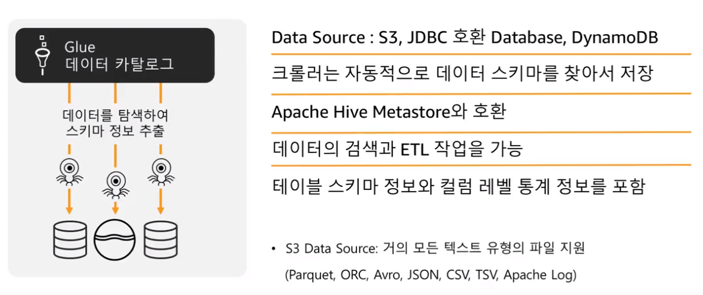
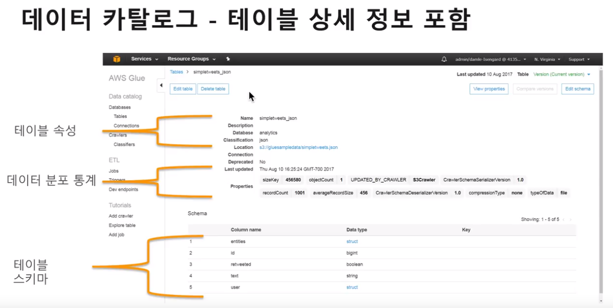
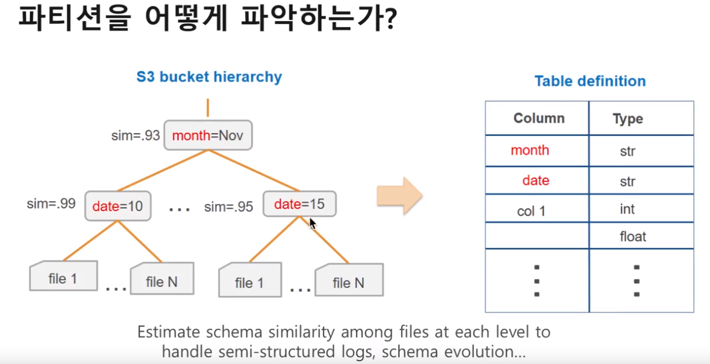
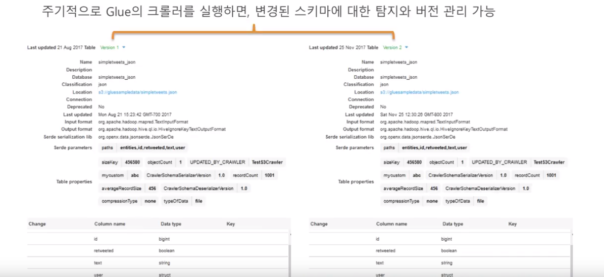
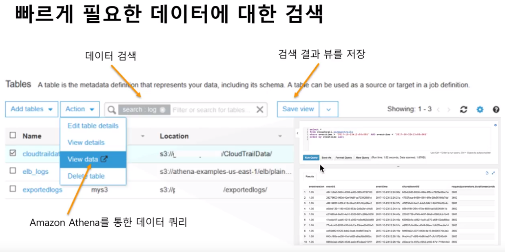
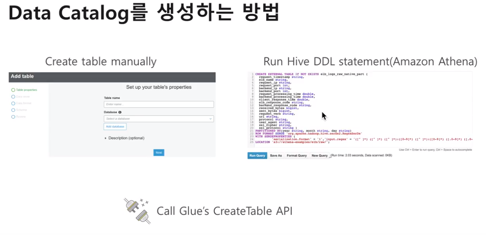
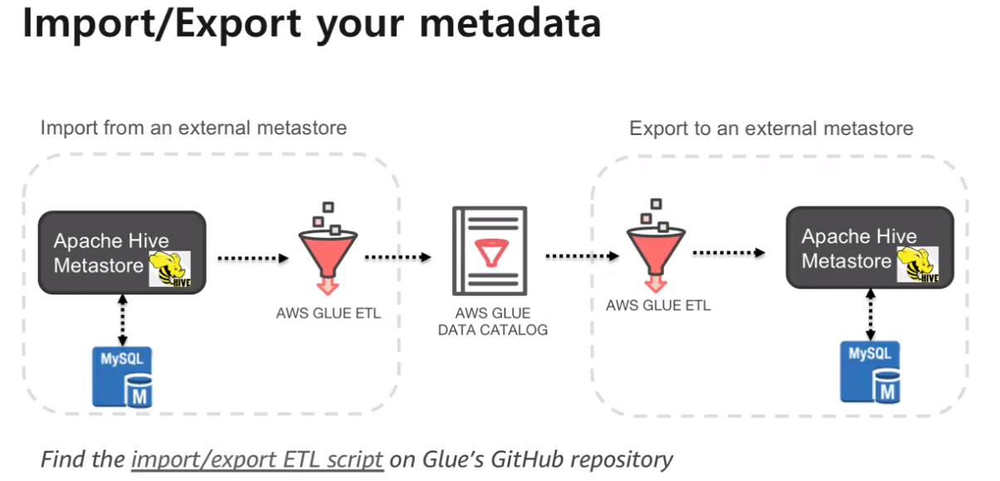
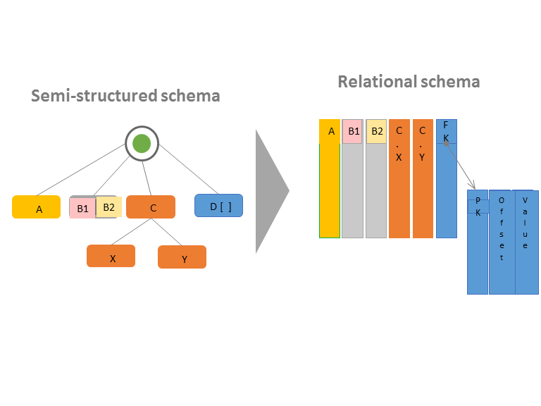

# Glue
AWS Glue 주요 기능

https://www.youtube.com/watch?v=LkkgtNtuEoU&

[https://youtu.be/LkkgtNtuEoU](https://youtu.be/LkkgtNtuEoU)

## glue 데이터 카탈로그

### 스키마 크롤러

### 테이블 상세 정보

### 파티션 자동 파악

### 스키마 변경 탐지 및 버전 관리

### 바로 데이터 쿼리 가능하도록 연결 + 쿼리 결과를 뷰로 저장

### 테이블 생성

### metadata (데이터 카탈로그) 가져오기 / 내보내기

### 데이터 카탈로그가 있으면
- 필요한 데이터 검색 가능 (어떻게 검색하는지 궁금)
- ETL 작업의 데이터 소스로 즉시 활용 가능
- 여러 DB에서 단일된 뷰로 동일한 데이터에 접근 / 활용 가능

### 반정형 데이터에 대한 스키마를 생성
- https://docs.aws.amazon.com/ko_kr/glue/latest/dg/schema-relationalize.html

- RDB가 아닌 경우 매핑이 자동으로는 안되더라도 수동으로는 할 수 있게 해주자

### glue 데이터 카탈로그 구성 요소
* **AWS Glue 데이터 카탈로그**

AWS Glue 데이터 카탈로그는 영구적 메타데이터 스토어입니다. 이것은 관리된 서비스로써 Apache Hive 메타스토어와 같이 동일한 방법으로 AWS Cloud에서 메타데이터를 저장, 참조 및 공유할 수 있습니다.

* **AWS Glue 크롤러 및 분류자**

AWS Glue는 모든 종류의 리포지토리에서 데이터를 스캔하고 분류하며, 스키마 정보를 추출하고, AWS Glue 데이터 카탈로그에서 자동적으로 메타데이터를 저장하는 크롤러를 설정할 수 있습니다.

### APIs

https://docs.aws.amazon.com/ko_kr/glue/latest/dg/aws-glue-api.html

- search tables api 는 필터 조건을 요청 파라미터로 받는 데, 자세한 필터 설명은 모르겠음

