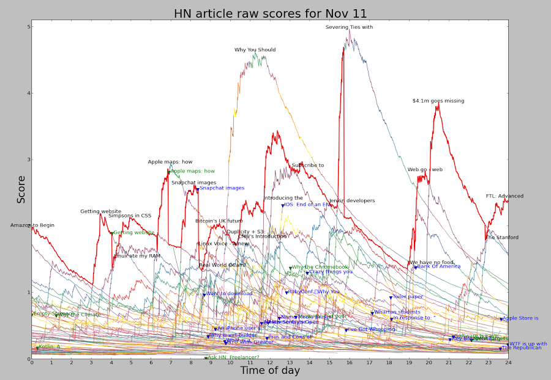
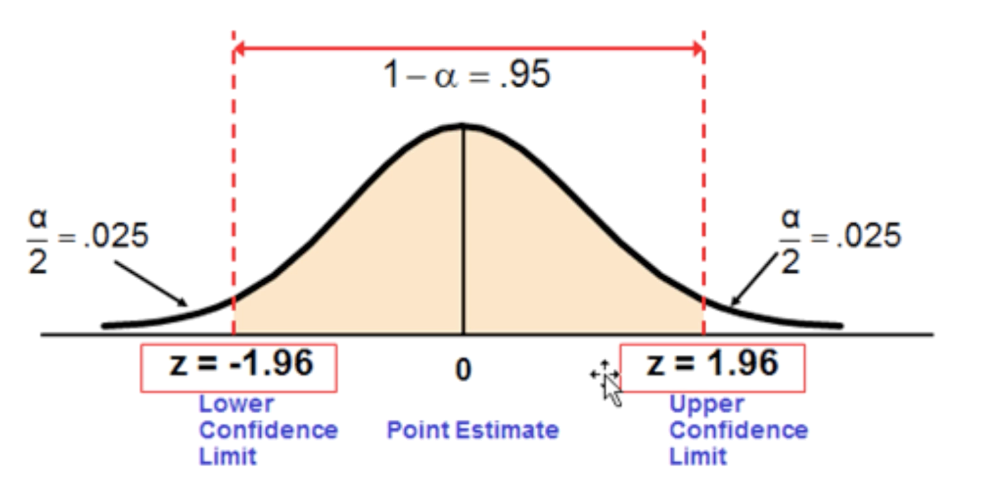
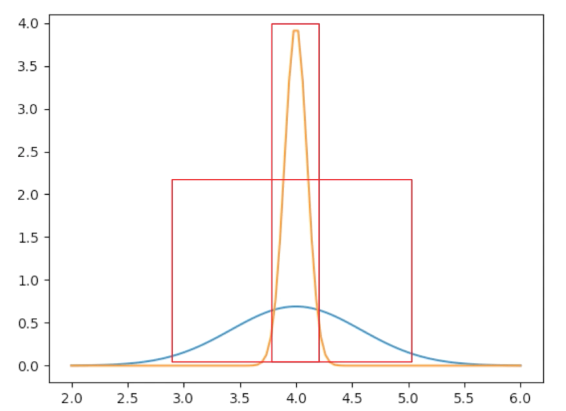
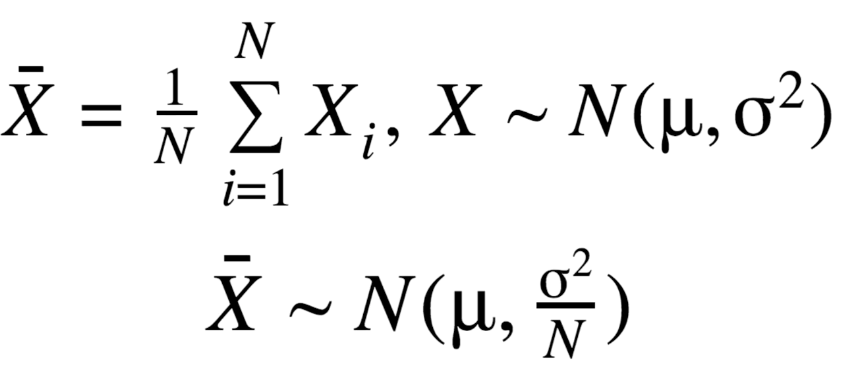
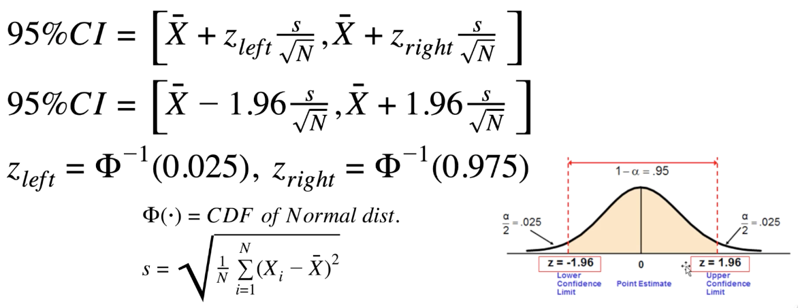
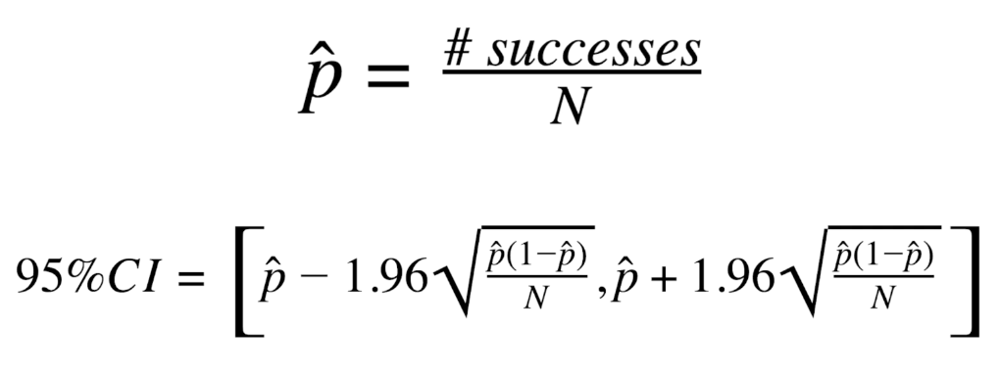
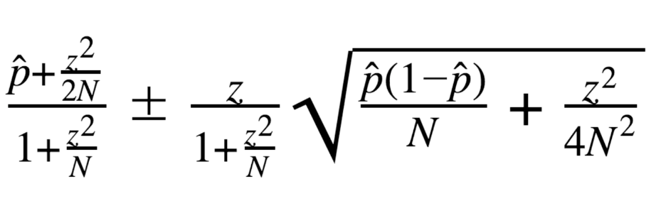
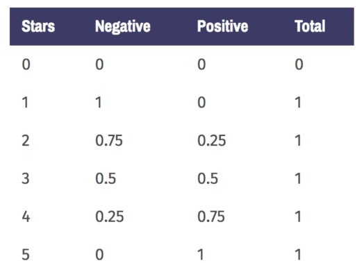
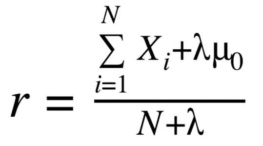

# Simple Recommendation Systems

Udemy - [Recommender Systems and Deep Learning in Python](https://www.udemy.com/course/recommender-systems)
중 Section 2 의 내용

* Non-Personalized recommenders 에 대한 내용들을 다룬다.
    * amazon.com, youtube.com 등에 처음 들어갔을 때 보여주는 상품이나 컨텐츠 등을 추천하는 방법

* section outline
    * 단순한 직관 (ex. 흥행도, 인기도)
    * 뉴스피드같은 경우 얼마나 최근인지를 고려해야 함
    * 평균 평점으로 정렬하는 것의 문제
    * 베이지안 패러다임
    * 지도학습
    * Markov 모델과 PageRank

## Basic Intuitions
### Popularity
* ex. 식당 추천
* 대다수의 사람들이 좋아하는 것을 추천하는 방법
* 친숙하기 때문에 가장 편안한 선택지
* 문제점
    * 각자 처한 상황에 따라 좋은 추천이 아닐 수 있으며 
    * 이미 알고 있을 확률이 높은 선택지이기 때문에 의미 있는 정보가 아닐 수 있다
### Age
* 영화나 음악같은 경우 주요 요소가 될 수 있음
* 뉴스나 레딧 글 같은 경우 최근 컨텐츠를 주로 소비하기 때문에 추천시에 고려해야 함

## Association
### Things that go together
* ex. 다른사람들이 함께 산 물건 추천 (인터넷쇼핑)
### 상품간 연관성을 찾는 방법
* 첫번째 가정
    * count(A, B) / count(B)
    * 1에 가까울 수록 자주 같이 구매되었을 것을 알 수 있음
    * P(A|B) 와 같음
* 그러나 한 방향으로만 연관성이 높을 수 있음
    * 아기 침대를 산 사람은 시트를 같이 구매할 가능성이 높지만 반대는 아님
* Lift
    * Lift = p(A, B) / p(A)p(B) = p(A|B) / p(A) = p(B|A) / p(B)
    * `A & B` 가 독립적이면, p(A|B) = p(A) 이고, p(A|B) / p(A) = 1 이다.
    * B를 사는 것이 A 를 사는 확률을 높여준다면 Lift > 1 이다.

## Hacker News
* 보통 다른사람이 좋아할 만한 것을 당신도 좋아할테지만, 뉴스같은 경우 3년전에 제일 인기있던 뉴스를 지금 보고싶어할 만한 사람은 거의 없을것이다.
### age 와 popularity 균형 맞추기
* f(popularity) = g(age)
### Hacker News Formula
* score = (ups - downs - 1)^0.8 / (age+2)^gravity * penalty
    * ups & downs - votes
    * gravity = 1.8
    * penalty = 비즈니스 로직에 의해 정해짐 (비공개)
* gravity > 0.8 이기 때문에 age 가 항상 popularity 를 추월하게 된다
* 0.8 승은 sublinear growth 곡선을 그린다.
    * 0 -> 100 의 변화가 1000 -> 1100 의 변화보다 더 의미있다
### Power Law
* 기사가 받는 표 (up&down vote) 의 분포는 power law 를 따르는 거
* 소수의 기사만이 많은 표를 얻고, 대부분은 적은 표를 얻는다.
### extra reading
* http://www.righto.com/2013/11/how-hacker-news-ranking-really-works.html
{:height="50%" width="50%"}

## Reddit
* hacker news 와 다른 점은 down vote 를 누구나 할 수 있다는 것
* hacker news 는 포인트가 쌓여야 가능
### Reddit Formular
* score = sign(ups - downs) * log{max(1, |ups - downs)|} + age/45000
* log 도 sublinear 한 함수
* signum = 부호함수
* age term 은 항상 선형으로 증가
* score 순으로 정렬하기 때문에 상대적인 점수차이가 중요
### 컨텐츠 검열 논란
* 특정 정치인 관련 글을 상위 노출되지 않게 검열했다는 논란이 있음
* 대형 사이트가 이런식으로 자신의 사이트를 통제할 권한이 있는가?
* ex. Russian Trolls

## Problems with Average Rating & Explore vs. Exploit
### Rating 
* up&down vote 시스템에서는 2가지 옵션밖에 없지만 별 다섯개 평가는 다양하게 해석할 수 있다.
* up&down vote 와 같은 binary outcomes 는 classification 으로,
* 별 5개 리뷰는 regression 으로 생각할 수 있다.
### Average Rating
* 쉬운 추천 방법: 평균 별점으로 정렬하기
* 문제점
    * 평균 평점이 5인데 평가가 하나뿐인 아이템과, 평균 평점이 4인데 평가가 많은 아이템은 첫 번째가 노출되는데, 이게 믿을만한 결과일까?
### Confidence
* 통계학의 신뢰구간
    {:height="50%" width="50%"}
* 추정에 얼마나 신뢰도가 있는지 한계선을 확인할 수 있음
* 전형적인 ranking, rating 방법은 신뢰구간 하한선에 비관적이다
* 하한선으로 정렬해야 하는 이유?
    * 4점을 받은 2개의 아이템이 있다고 가정해보자.
    * 아이템 1은 3개의 평가를, 아이템 2는 100개의 평가를 받았다.
    * 아이템 2의 샘플 크기가 더 크기 떄문에 4점이라는 평가에 높은 신뢰도를 가질 수 있다.
    * 아이템 2의 신뢰구간이 더 좁고 신뢰구간의 상, 하한이 더 4점에 가깝다
        {:height="50%" width="50%"}
* 신뢰구간
    * 랜덤 변수 X 가 주어질 때, 샘플의 평균의 분포를 계산할 수 있다.
    * 샘플이 많으면 많을수록 분포 구간이 좁아진다.
        {:height="30%" width="30%"}
    * 신뢰구간을 구하는 방법
        {:height="50%" width="50%"}
        * 여기서 s 는 데이터의 표준편차
* 만약 데이터가 정규 분포를 따르지 않는다면?
    * central limit theorem 에 의해 랜덤 변수의 합은 정규분포로 수렴하게 되기 때문에 문제 없다.
    * X_bar = (1/N) * (X_1 + X_2 + X_3 + ... X_N)
* 베르누이 신뢰구간 추정
    * 0 또는 1 의 결과를 가지는 변수일 경우 (up&down vote)
        {:height="30%" width="30%"}
* Wilson Interval
    * 더 나은 신뢰구간 추정법
        {:height="30%" width="30%"}
    * z = 1.96 (95% 신뢰구간에 대한 상수)
    * reddit 이 wilson 구간을 이용하여 comment 를 정렬한다
### 5-star ratings 확장하기
* 다음과 같이 여러 방법으로 해석 가능
    {:height="50%" width="50%"}
* 하한선으로 정렬하는 것은 너무 비관적이지 않나?
    * 1개의 평가만 받은 좋은 상품이 매우 불리한 위치
    * 그러나 평가를 한 사람의 수를 나타내기 때문에 좋을 수 있다.
    * 평가한 사람의 수가 많으면 높은 하한선을 가지게 되고, 이런 의미에서 상품의 인기는 점수를 상승시킨다.
### average rating 의 또다른 문제
* 샘플 데이터가 매우 작거나 없다면?
* Smoothing (or dampening) 방법으로 기본값을 정해줄 수 있다.
    {:height="30%" width="30%"}
* 위 식으로 글로벌 평균을 정할 수 있다 (3과 같은 중간값으로)
    * 문제는 대부분의 사람들이 3점을 안좋게 본다는 것
    * 3점을 가진 모든 상품들이 안좋은 평가를 가진 것 처럼 보일 수 있다.
### Explore-Exploit Dillema (탐색-이용 딜레마)
* 이미 알고있는 방법을 고수할 것인지, 더 나은 방법을 찾아볼 것인지 결정해야 하는 딜레마
* 예를 들어 카지노에서 어떤 슬롯머신이 가장 승률이 좋은지 테스트해보는 상황에서 (승률로) 몇번이나 각 슬롯머신을 테스트 해야할까? 
    * 너무 적은 횟수를 하면 추정값의 퀄리티가 떨어질 것이다.
* 10개의 슬롯머신을 100번씩 테스트해본다고 하자
    * 최고 승률의 슬롯머신을 제외한 9개의 슬롯머신의 승률은 최적이 아니다. (suboptimal)
    * 여기서 더 테스트 해봐야 하는지, 덜 테스트해봐야 하는지 딜레마가 발생함
    * 이런 고민을 Explore-Exploit Dillema 라고 한다.
* explore-exploit 사이에서 균형을 잡는 방법?
    * smoothed average 가 해답중 하나가 될 수 있다.
        * 안 좋은 상품을 더 좋게 평가하고, 좋은 상품을 덜 좋게 평가하기 때문
    * Bayesian 을 이용해서 해결할 수도 있다.