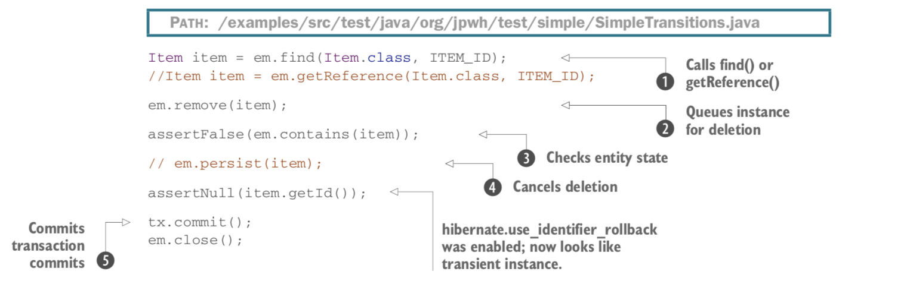
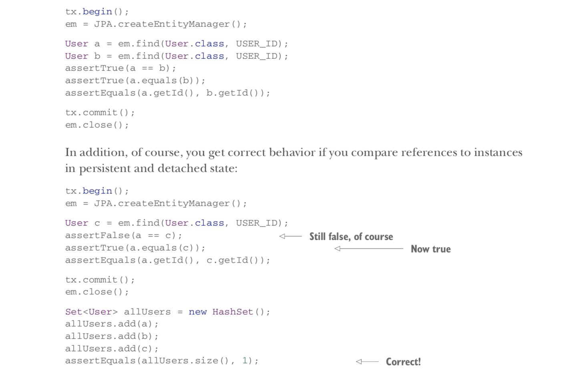
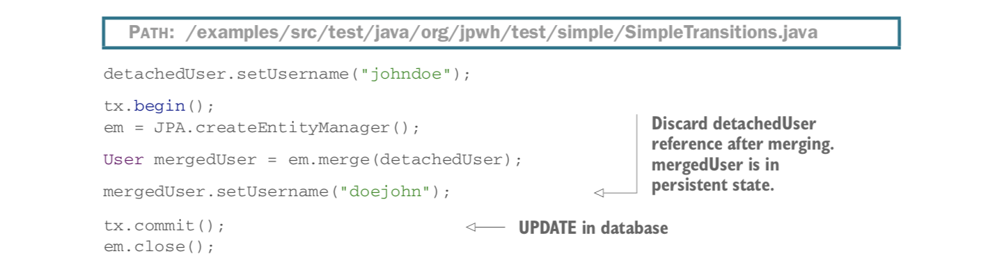

# 10 Managing data

* Java Persistence with Hibernate, 2nd Edition by rajeev 의 10장을 읽고 정리한 내용

# 챕터 요약
- 객체의 생명주기와 상태 (lifecycle & state)
- Java Persistence API 와의 동작
- 분리된 (detached) 상태의 동작

# 10.1 영속 생명주기 (persistence life cycle)

* entity state
* persistence context
* managed scope

* Java Persistence 를 잘 사용하려면 상태 관리를 잘 이해하는 것이 중요

## 10.1.1. Entity Instance states
- JPA 는 아래 그림과 같이 4개의 상태를 정의한다

**Transient state**

Java의 new 연산자로 만들어진 인스턴스는 transient 상태이다. 인스턴스가 더이상 참조되지 않으면 상태가 유실되고 gc 된다.

엔티티 객체가 transient 상태에서 persistence 상태로 전환되려면 EntityManager#persist() 함수를 호출하거나 이미 persistent 상태이고 매핑 연관관계에 대해 cascading이 활성화된 인스턴스로부터 참조될 필요가 있다

**Persistence state**

Persistent 한 엔티티 객체는 데이터베이스에 저장되어있거나 한 단위의 작업이 완료되면 저장될것이다.

persistent 객체를 얻는 방법

- 애플리케이션에서 인스턴스를 생성하고 EntityManager#persist() 함수를 호출
- JPA provider 가 이미 관리중인 persistent 한 객체로부터 해당 오브젝트로의 참조를 생성
- 쿼리를 실행해서 db에서 추출한 데이터로부터 객체를 얻기
- 다른 persistent 객체로부터 시작해 다른 객체로 찾아가기

persistent 객체는 항상 persistence context 와 연관되어있다

**Removed state**

persistent 엔티티 객체를 여러 방법으로 삭제할 수 있다

- EntityManager#remove 호출
- orphan-removal 기능이 활성화된 상태로 매핑된 콜렉션으로부터의 참조를 삭제

위 방법으로 엔티티 객체는 removed 상태가 되고, provider 는 한 단위의 작업이 끝나면 해당 엔티티를 삭제할것이다

**Detached state**

detached 엔티티 객체를 이해하려면, 객체를 로딩하는 것을 생각해봐야한다.

EntityManager#find() 를 호출해서 엔티티 객체를 추출한 후 한 단위의 작업을 끝내고 persistence context 를 닫는다고 했을때 애플리케이션은 이미 로드한 인스턴스를 참조하는 핸들을 아직 가지고있다. 

이 상태를 detached 상태라고 하며, 데이터는 낡기 시작한다. 

이 참조를 버리고 메모리에서 삭제되게 할 수도 있고, detached 상태에서 계속 작업을 하다가 merge() 함수를 호출해서 변경사항을 새 단위 작업에서 저장하도록 할 수도 있다.

## 10.1.2 Persistence Context

EntityManager 는 하나의 Persistence Context 를 가진다.

EntityManagerFactory#createEntityManager() 를 호출할 때 persistence context 가 생성되고, EntityManger#close() 를 호출하면 컨텍스트가 닫힌다.

영속 컨텍스트는 영속 상태인 모든 엔티티를 감시하고 관리한다.

영속 컨텍스트는 애플리케이션이 어떤 엔티티를 수정했는지 알아냄으로써 영속 엔진이 automatic dirty checking 을 수행할 수 있도록 해준다.

영속 컨텍스트는 1차 캐시처럼 동작한다. 특정 단위 작업동안 처리한 모든 엔티티 객체를 기억한다.

예를 들어 엔티티 객체를 pk 로 로드할 때 현재 단위 작업을 먼저 영속 컨텍스트에서 체크한 후, 영속 컨텍스트에서 해당 객체를 찾으면 db 를 조회하지 않는다. (repeatable read 의 경우)

영속 컨텍스트 캐시는 끌 수 없으며, 다음을 항상 보장한다.

- 객체 그래프에서 순환 참조가 발생하는 경우에도 영속 레이어가 스택 오버플로우 문제에 취약하지 않음
- 하나의 단위 작업이 끝나는 시점에 같은 db 상에서 충돌되는 표현이 존재하지 않는다. 
- 마찬가지로 특정 영속 컨텍스트 내에서 발생된 변경사항은 같은 단위작업과 영속 컨텍스트 내에서 실행되는 코드에서 바로 확인된다. JPA 는 repeatable entity-instance read 를 보장한다

영속 컨텍스트는 객체 동일성의 보장된 범위(*guaranteed scope of object identity*)를 제공한다. 단일 영속 컨텍스트의 범위에서는 단 하나의 인스턴스만이 특정 db 의 row 를 나타낸다.

entityA == entityB 의 참조 비교를 생각해보면, 이는 두 참조가 동일한 자바 인스턴스를 참조할때만 참이다.

entityA.getId().equals(entityB.getId()) 를 생각해보면,  db 상의 동일한 식별자 값을 가지고 있을때 참이다.

하나의 영속 컨텍스트 내에서, 하이버네이트는 두 비교가 동일한 결과를 냄을 보장한다.

# 10.2 EntityManager interface

Java Persistence 애플리케이션에서는, 단위 작업을 생성하기 위해 상호작용하는 주요 인터페이스가 EntityManager 이다.

## 10.2.1 canonical unit of work

보통은 애플리케이션에서 EntityManagerFactory#createEntityManager() 를 호출해서 EntityManager를 획득하고, 단 하나의 EntityManagerFactory 를 공유해서 사용한다.

EntityManager 를 생성하면 그것의 영속 컨텍스트가 시작된다. 

빈 catch 구문을 작성하지 말고 롤백이나 예외처리를 해주도록 하자

하이버네이트는 필요하지 않으면 db 에 접근하지 않고, sql 명령문이 실행되어야 하기 전까지는 jdbc 커넥션을 획득하지 않는다.

하이버네이트는 EntityManager 가 생성될 때 진행중인 시스템 트랜잭션과 결합하여 트랜잭션이 커밋될 때 까지 기다린다.

하이버네이트가 JTA 에 의해 커밋을 알림받으면 영속 컨텍스트와 더티체크를 한 후 db 와 동기화한다.

수동으로 더티체크와 동기화를 하려면 transaction 동안 아무때나 EntityManager#flush 를 호출하면 된다.

영속 컨텍스트를 어느 시점이든 닫아줘야하기 때문에 finally block 에서 close 를 호출해주자.

## 10.2.2 Making data persistent

트랜잭션이 커밋되면, 하이버네이트는 영속 컨텍스트를 flush 하고, 이 때 insert 가 수행된다.

persist() 를 호출할 때는 단지 Item 의 식별자 값만 할당된다. 

대신, 식별자 생성자가 pre-insert 방식이 아닐 경우 (4.2.5 참조, 예를들어 select 방식) persist() 를 호출하면 바로 insert 구문이 수행된다.

Item 을 영속화하여 관리하기 전에 완전히 초기화하는 것이 권장된다. 

하이버네이트는 flush 를 하는 중 제약 조건 위배 (NOT NULL 이라든지) 로 실패하게 되면 트랜잭션에서 영속화된 인스턴스에 대한 변경사항은 DB 레벨에서는 롤백이 된다. 하지만 인메모리 변경사항까지는 롤백해주지 않는다. 따라서 persist 호출 후 Item#name 을 변경하면, 커밋 실패시 메모리상의 인스턴스는 예전 이름으로 롤백되지 않을 것이다. 이것이 합리적인 이유는 트랜잭션 실패는 보통 복구 불가능하기 때문에 실패한 영속 컨텍스트와 EntityManager 를 바로 버려야 하기 때문이다.

**엔티티 객체의 상태 판단하기**

- persistent : EntityManager#contains(e) 가 true 일 경우
- transient : PersistenceUnitUtil#getIdentifier(e) 가 null 을 반환할 경우
- detached : persistent 상태가 아니고, PersistenceUnitUtil#getIdentifier(e) 의 값이 null 이 아닐 경우
- PersistenceUnitUtil 은 EntityManagerFactory 에서 가져올 수 있다
- 주의점
    - id 값은 영속 컨텍스트가 flush 되기 전엔 할당되지도, 사용 가능하지도 않다
    - id 프로퍼티가 primitive 일 경우 (Long 이 아니라 long 일 경우) PersistenceUnitUtil#getIdentifier() 는 null 을 절대 반환하지 않는다

## 10.2.3 Retrieving and modifying persistent data

새로운 단위 작업에서 미리 알고있던 Item 의 id 값으로 인스턴스를 찾는 경우

find() 는 제네릭 함수라서 반환 객체에 대한 타입 캐스팅이 필요 없다.

주어진 id 값으로 영속 객체를 찾을 수 없으면 find() 는 null 을 반환한다.

find() 는 영속 컨텍스트 캐시에서 조회되지 않을 경우 항상 DB를 조회한다.

엔티티 인스턴스는 로딩할 때 항상 초기화된다. 그래서 detached 상태에도 모든 값이 사용 가능하다.

하이버네이트는 2차 캐시가 활성화 된 경우 DB 를 조회하지 않을 수도 있다 (20.2 참고)

Item 을 수정할 경우 영속 컨텍스트가 이를 발견하고 SQL Update 를 통해 DB 에 자동으로 기록한다. 기본적으로는 update 구문에 item 의 모든 컬럼 값을 포함하지만, 변경된 값만 포함하고 싶다면 dynamic SQL generation 기능을 활성화 할 수도 있다 (4.3.2 참고)

Item#name 을 변경할경우 하이버네이트는 Item 을 로드할 때 가져온 스냅샷 카피와 비교해서 업데이트가 필요한지 확인한다. 이 더티 체킹은 모든 인스턴스를 비교하기 때문에 시간과 메모리를 많이 소모한다.

커스터마이징 하고싶다면 hibernate.entity_dirtiness_strategy 에 org.hibernate.CustomEntityDirtinessStrategy 를 구현한 클래스를 설정하거나
org.hibernate.Interceptor 의 findDirty() 를 구현하는 방법이 있다. (13.2.2 참고)

전에도 말했던것처럼 영속 컨텍스트는 repeatable read 를 가능하게 한다.

## 10.2.4 Getting a reference

만약 엔티티 객체를 로딩할 때 완전히 초기화된 객체가 필요한지 확실하지 않아서 DB 조회를 하고싶지 않다면 EntityManager 에게 빈 placeholder - proxy 만을 가져오도록 할 수 있다.

1. 영속 컨텍스트가 이미 해당 객체를 가지고 있다면 DB 를 조회하지 않고 해당 인스턴스를 반환한다.  없다면 하이버네이트는 빈 placeholder 인 proxy 객체를 생성한다. 
2. PersistenceUnitUtil 의 isLoaded 와 같은 헬퍼 함수들로 프록시가 초기화 되었는지 확인할 수 있다
3. proxy 에 Item#getName() 과 같은 함수를 호출하면 바로 객체를 초기화하기 위해 select 가 수행된다. 단 getId 와 같이 식별자 값을 가져오는 경우는 예외다. 만약 프록시가 초기화 될때 해당되는 데이터가 DB 에 없다면 EntityNotFoundException 이 발생한다.
4. 프록시의 데이터를 로드하기 위해 initialize 라는 정적 함수도 사용할 수 있다.
5. 영속 컨텍스트가 닫히면 item 은 detached 상태가 된다. 만약 영속 컨텍스트가 열려있는 상태에서 proxy 객체를 초기화 안한 상태로 접근하면 LazyInitializationException 이 발생한다. 컨텍스트가 닫혀있는 상태에서는 데이터 로드가 불가능하다.

## 10.2.5 Making data transient

2. remove() 는 단위 작업이 완료될때 엔티티 인스턴스를 삭제하기 위해 큐에 넣는다. 이 때 removed 상태가 된다. 만약 proxy 에 remove() 를 호출할 경우 하이버네이트는 데이터 로드를 위해 select 를 수행한다. 엔티티 인스턴스는 생명주기 전환동안 완전히 초기화 되어야 한다. 만약 생명주기 콜백 함수나 활성화된 엔티티 리스너 등이 있다면 해당 인터셉터도 거쳐야 생명주기를 완전히 완료할 수 있다.
3. removed 상태일 때 contains 함수로 확인할 수 있다.
4. persist() 를 호출해서 삭제를 취소할 수 있다.
5. 트랜잭션이 커밋되면 하이버네이트는 상태 전환을 DB 와 동기화하고 sql delete 를 수행한다. JVM 가비지 컬렉터는 item 이 더이상 참조되지 않는지 확인하고 데이터를 삭제한다.

기본적으론 하이버네이트는 삭제된 상태인 엔티티의 id 값을 변경하지 않는다. 이는 삭제된 데이터를 다시 저장하려고 할 때 유용하다. 반대로 hibernate.use_identifier_rollback 프로퍼티를 true 로 설정하면 엔티티 인스턴스를 삭제하고 나면 id 값을 리셋할 것이다. 이 경우 해당 인스턴스는 transient 상태와 동일하다.

## 10.2.6 Refreshing data

엔티티 인스턴스를 로드한 후 DB 에서 데이터가 변경될 경우 refresh() 를 호출하면 하이버네이트가 select 를 수행하여 메모리에 있는 영속 인스턴스에 변경사항을 덮어쓴다. 만약 해당 데이터 row 가 DB 에 없다면 EntityNotFoundException 예외가 발생할 것이다. 

**** 대부분의 애플리케이션은 수동으로 인메모리 상태를 refresh 하지 않는다. 동시성 변경은 트랜잭션 커밋시 충돌을 해결. 가장 적절하게 refresh 를 사용하는 케이스는 몇개의 요청/응답 주기나 시스템 트랜잭션에 걸친 긴 영속 컨텍스트를 가지는 경우이다. 예를 들어 유저 입력을 받아야 하는 경우 입력을 기다리면서 부분적으로 refresh 를 할 필요가 생길 수 있다. refresh 는 대화 도중 사용자가 이를 취소해버리는 경우 변경사항을 되돌리는데 유용하다.

## 10.2.7 Replicating data

복제는 하나의 영속컨텍스트에 로드된 detached 상태의 인스턴스를 다른 영속 컨텍스트로 영속화시킨다. 보통은 두개의 다른 EntityManagerFactory 설정을 통해 컨텍스트를 열고 두 개의 논리적 DB를 사용한다. 
replicate() 는 하이버네이트 Session API 에서만 사용할 수 있다.

**Replication Mode**

- IGNORE - DB 에 같은 id 값의 row 가 있으면 해당 인스턴스 무시
- OVERWRITE - DB 에 같은 id 값의 row 가 있으면 해당 인스턴스 값으로 덮어쓰기
- EXCEPTION - DB 에 같은 id 값의 row 가 있으면 예외 발생
- LATEST_VERION - DB 에 같은 id 값의 row 가 있으면 version 값을 확인하여 엔티티 인스턴스의 값이 더 최신이면 덮어쓰기

## 10.2.8 Caching in the persistence context

영속 컨텍스트는 영속 인스턴트들의 캐시이다.

하이버네이트를 사용할 때 OOM 이 발생할 경우는 보통 하나의 단위작업에서 너무 많은 엔티티를 수정하려는 의도 없이 로드했을 경우이다. (많은 엔티티를 한번에 수정하려는 경우에는 bulk 데이터 연산자를 사용하도록 하자. 20.1 참고)

영속 컨텍스트 캐시는 자동으로 줄어들지 않기 때문에 최소한으로 크기를 유지하도록 하자.

EntityManager#detach() 를 호출해서 영속 인스턴스를 수동으로 영속 컨텍스트에서 제거할 수 있다. EntityManager#clear() 를 호출하면 빈 영속 컨텍스트 상태로 만들 수 있다.

Session API 에서는 전체 영속 컨텍스트를 read-only 모드로 설정할 수 있는 기능을 제공한다. 이 경우 상태 스냅샷을 가지지 않고 더티체킹도 하지 않기 때문에 변경사항이 업데이트되지 않는다.

인스턴스 하나에 대해서만도 read-only 모드를 적용할 수 있다.

쿼리수준에서도 read-only 를 설정할 수 있다

주의할점은, read-only 모드의 엔티티 인스턴스도 여전히 삭제 가능하다는 것이다.

## 10.2.9 Flushing the persistence context

JPA는 원하는 시점에서의 영속 컨텍스트 동기화 전략도 허용한다.

**JPA 구현체로서의 하이버네이트의 동기화 시점**

- joined (결합된?) JTA 시스템 트랜잭션이 커밋됐을때
- 쿼리가 실행되기 전에 ( find 와 같은 lookup 이 아닌 javax.persistence.Query 또는 Hibernate API )
- 애플리케이션이 명시적으로 flush() 를 호출했을때

FlushModeType 을 EntityManager 에서 설정 가능

FlushModeType.AUTO 의 경우 하이버네이트는 데이터 변경사항을 쿼리를 날리기 전에 자동으로 DB 에 동기화한다.

FlushModeType.COMMIT 을 사용하면 쿼리를 날리기 전에 flush 하지 않게 되고, 따라서 메모리에 있는것과 다른 데이터를 조회 결과로 받게 될 것이다.

# 10.3 Working with detached state

## 10.3.1 The identity of detached instance

a 와 b 는 영속상태에서는 같은 인스턴스를 참조하며, 영속 컨텍스트가 닫히면 detached 상태가 된다.

위 예제에서 b 와 c 의 차이점은 a 와 같은 컨텍스트에 있는지 여부.

Set 은 Item#equals 함수를 통해 같은 원소가 컬렉션에 이미 있는지 확인한다.

equals() 의 기본 구현은 (java.lang.Object) == 연산자를 사용하고, 이는 두 참조가 자바 힙에 있는 같은 인메모리 인스턴스를 가리키는지 확인한다.

따라서 detached 상태의 인스턴스들로 동등성을 비교할때는 equals 와 hashcode 함수를 추가 구현해줄 필요가 있다.

## 10.3.2 Implementing equality methods

equals 를 오버라이드 할 때는 반드시 hashCode 함수도 오버라이드 해줄 필요가 있다.

equals 가 Id 값만 비교하도록 하는 것이 현명해보일수도 있다. 하지만 이 방법은 하이버네이트가 아직 persistent 상태가 되기 전일때 id 값을 부여하지 않은 상태일수도 있어서 문제가 있다. 

권장되는 해결 방법은 business key 라는 개념을 사용하는 것이다. 비즈니스키는 프로퍼티이거나 프로퍼티의 조합으로, 같은 db 에서 인스턴스마다 고유한 값을 가질 수 있으면 된다.

책에서는 모든 엔티티가 비즈니스 키를 가질 것을 권장한다.

위 예제 equals 구현에서 other 의 프로퍼티들을 접근할 때 항상 getter 메소드를 사용하는 것에 주의하자. other 객체는 하이버네이트 프록시일 수도 있기 때문에 프록시의 필드에 바로 접근하면 안된다. 먼저 getter 메소드를 사용해서 프록시를 초기화해주자

other 인스턴스를 getClass() 함수가 아닌 instanceof 로 확인해주자. 런타임에 생성된 User 의 하위클래스일수도 있기 때문. (12.1.1 참고)

위 equals, hashCode 구현으로 아래 코드가 잘 동작함을 확인할 수 있다.

## 10.3.3 Detaching entity instances

인스턴스를 수동으로 바로 detached 상태로 만들 수 있다.

## 10.3.4 Merging entity instances

User 인스턴스가 이전 영속 컨텍스트에서 분리된 상태에서, 변경사항을 새로 저장하고 싶은 경우

위 경우에는 빈 컨텍스트 상태에서 merge() 를 호출했기 때문에 하이버네이트는 DB 에서 해당 식별자로 인스턴스를 로드해온다. 그 후에 detached 상태인 엔티티 인스턴스를 영속 인스턴스로 로드해온다. 즉, detached User 에 설정한 새로운 username 이 merge() 가 반환한 merged User 에도 반영된다.

merge 를 호출한 후에는 detached 상태의 이전 참조를 버리도록 하자.

만약 같은 식별자를 가진 인스턴스가 영속 컨텍스트나 DB 에 없다면 하이버네이트는 새로운 User 인스턴스를 만들것이다. 

detached 상태가 아닌 transient 상태의 인스턴스를 merge 하면 하이버네이트는 새로운 User 인스턴스를 만들고 transient User 의 값을 복사한 후 persistent 상태로 만들어 반환할것이다.

merge() 를 사용하면 persist() 함수를 사용하지 않고도 영속화 할수 있다. 차이점은 merge() 의 경우 이전 참조를 버려야 한다는 것이다.

대신 Hibernate Session API 는 saveOrUpdate() 로 reattach 를 할 수 있도록 하는데, 이경우 메소드는 반환 값이 없으며, 기존 인스턴스는 persistent 상태가 되고, 기존 참조를 바꿀 필요가 없다. 때문에 merge 보다는 해당 API 가 권장된다. saveOrUpdateCopy() 는 merge() 와 같은 일을 하는 API 이다.

detached 인스턴스를 지우려면 먼저 merge 한 후 merge 가 반환한 참조로 remove를 호출해야한다.

# 10.4 Summary
- JPA 앱에서 엔티티 인스턴스와 상호작용하는 주요 전략들을 확인
- 엔티티 인스턴스의 생명주기와 어떻게 persistent, detached, removed 상태가 되는지 확인
- EntityManager 는 JPA 의 가장 중요한 인터페이스
- 대부분의 앱에서, 데이터는 분리된 상태에서 저장되고 로딩되지 않는다. 하이버네이트는 multi user application 에도 잘 통합되며, 동시적으로 많은 쓰레드에서 DB 를 접근할 수 있다.

