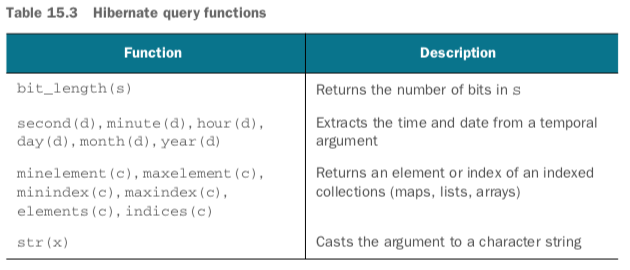

# 15 The query languages

* Java Persistence with Hibernate, 2nd Edition by rajeev 의 15장을 읽고 정리한 내용
* ( ~ 369p )

# 챕터 설명
- JPQL 과 criteria 쿼리 작성하기
- join 으로 데이터를 효율적으로 추출하기
- subselect 와 reporting query

- 이 챕터에서 JPA 에서 사용 가능한 query language 인 JPQL 과 criteria query API 를 다룰 예정
- select 문 위주로 살펴볼 예정
- 이 챕터는 레퍼런스로 사용하는게 좋고, 짧은 코드 예제 위주로 진행될것

## Major new features in JPA 2
- CASE, NULLIF, COALESCE 연산자 지원
- TREAT 연산자 downcast 가능
- …


# 용어 정리
- selection
    - 어디서 데이터를 가져올 것인지 정의
- restriction
    - 특정 기준에 맞는 레코드를 찾기 위해 적용
- projection
    - 쿼리로부터 반환될 데이터를 선택하기 위해 적용


## 15.1 selection
- selection 은 FROM 구문 또는 relation variable 을 선택하는 것을 말한다
    - SELECT … 구문을 말하는 것이 아님
    - 간단히는 어떤 테이블에서 “select” 를 할 것인지에 대한 내용
    - JPQL 에서는 테이블 대신에 어떤 클래스에 대한 데이터를 얻을 것인지

```sql
select i.ID, i.NAME, ... from ITEM i
```

```java
CriteriaQuery criteria = cb.createQuery(Item.class);
criteria.from(Item.class);
```

- 위 쿼리는 JPA 호환성이 없어서 서로 portable 하지 않음
    - JPA 표준에선 JPQL 은 select 구문을 가져야하고, criteria 쿼리는 select() 함수를 호출해야 한다

### 15.1.1 Assigning aliases and query roots
- select 구문을 JPQL 에서 사용하려면 FROM 구문에서 alias 를 부여해야 한다
- as 키워드는 optional
```sql
-- JPA compliant
select i from Item as i
```
- alias 는 case-insensitive


- portable criteria 쿼리는 select() 를 호출해야 한다
```java
CriteriaQuery criteria = cb.createQuery();
Root<Item> i = criteria.from(Item.class);
criteria.select(i);
```
- criteria 의 `Root` 는 항상 entity 를 참조한다
- `Metamodel` API 를 사용해서 entity type 을 동적으로 look up 할수도 있다
```java
EntityType entityType = getEntityType(em.getMetamodel(), "Item");
criteria.select(criteria.from(entityType));
```
- `getEntityType` 은 저자가 추가한 `Metamodel#getEntities()` 를 래핑한 함수

### 15.1.2 다형적 쿼리 (Polymorphic queries)
- `BillingDetails` 가 abstract class 일 때, 아래 쿼리는 모든 하위 클래스의 인스턴스를 반환할 것이다.
```
select bd from BillingDetails bd
criteria.select(criteria.from(BillingDetails.class));
```
- FROM 구문의 클래스는 mapped persistent class 일 필요가 없어서 아래같은 쿼리도 가능하다
- 아래 쿼리는 모든 persistent object 를 반환한다.
```sql
select o from java.lang.Object o
```
- 모든 serializable 타입의 클래스를 로드하는 쿼리
```sql
select s from java.io.Serializable s
```
- 하지만 JPA 는 임의의 인터페이스에 대한 다형적 JPQL 쿼리를 표준화하지 않았음
- 해당 기능은 Hibernate 에서는 동작하지만, portable 한 앱이 되려면 FROM 구문에서는 매핑된 entity class 만 참조해야 한다
    - (BillingDetails 나 CreditCard 같은..)
- criteria 의 from() 메소드는 매핑된 entity class 만 허용한다
- 다형적이지 않은 쿼리는 `TYPE` 함수를 사용해서 가져올 수 있다
```sql
select bd from BillingDetails bd where type(bd) = CreditCard
select bd from BillingDetails bd where type(bd) in :types
```
```java
Root<BillingDetails> bd = criteria.from(BillingDetails.class);
criteria.select(bd).where(
    cb.equal(bd.type(), CreditCard.class) // cb.not 을 쓰면 except CreditCard 
);
Root<BillingDetails> bd2 = criteria.from(BillingDetails.class);
criteria.select(bd2).where(
    bd2.type().in(cb.parameter(List.class, "types"))
);
```

## 15.2 restriction
- restriction : 쿼리가 반환할 데이터에 대한 제약조건을 표현하는 부분
- 보통 WHERE 구문과 where() 함수에서 제약조건 선언

```sql
select i from Item i where i.name = 'Foo'
```
```java
Root<Item> i = criteria.from(Item.class);
criteria.select(i).where(
    cb.equal(i.get("name"), "Foo")
);
```

### Ternary logic
- SQL, JPQL, criteria 쿼리는 제약조건을 ternary logic (not binary) 로 표현한다
- WHERE 구문은 true, false, 또는 null 으로 평가되는 논리 표현식이다
- java 에서, `nonNullObject == null` 은 `false` 이고, `null == null` 은 `true`이다
- SQL 에서, `NOT_NULL_COLUMN = null`, `null = null` 은 모두 `true` 가 아닌 `null` 로 해석된다
- 따라서 `IS NULL` 또는 `IS NOT NULL` 연산자를 사용해서 `null` 값 체크를 해야한다

### 15.2.1 Comparison expressions
- 예제
```sql
select b from Bid b where b.amount between 99 and 110
```
```java
Root<Bid> b = criteria.from(Bid.class);
criteria.select(b).where(
    cb.between(
        b.<BigDecimal>get("amount"),
        new BigDecimal("99"), new BigDecimal("110")
) );
```
- criteria 의 코드는 다소 생소할 수 있는데, `Root#get()` 메소드는 엔티티 속성의 `Path<X>` 를 반환한다.
- 타입 안정성을 유지하기 위해 위와 같이 속성 타입을 명시해줘야 한다
- criteria 의 `gt()` 함수는 `Number` 타입만 허용하므로 `Date`와 같은 타입을 사용하려면 `greaterThan()` 을 사용해야 한다

- 예제들
    - IN 구문
    - enum 사용
    - IS (NOT) NULL 연산자
    - LIKE 연산자 /w escape
        - % : 문자열에 대한 wildcard
        - _ : 하나의 문자에 대한 wildcard
        - escapeChar 를 지정해서 escape 가능 (보통 `\\` 를 사용)
    - 산술 표현식
    - 논리 연산자
    - AND 로 이어진 WHERE 구문의 경우 criteria 에서는 파라미터 나열 방식으로 간단하게 작성 가능

- `Predicate` 사용
```sql
select i from Item i
where (i.name like 'Fo%' and i.buyNowPrice is not null)
    or i.name = 'Bar'/
```
```java
Root<Item> i = criteria.from(Item.class);
Predicate predicate = cb.and(
    cb.like(i.<String>get("name"), "Fo%"),
    cb.isNotNull(i.get("buyNowPrice"))
);
predicate = cb.or(
    predicate,
    cb.equal(i.<String>get("name"), "Bar")
);
criteria.select(i).where(predicate);
```

### 15.2.2 Expressions with collections
- items collection 에 원소가 있는 Category 인스턴스들을 가져오는 예제
```sql
select c from Category c
    where c.items is not empty
```
```java
Root<Category> c = criteria.from(Category.class);
criteria.select(c).where(
    cb.isNotEmpty(c.<Collection>get("items"))
);
```

- 예제들
    - collection size 비교
    - collection 내에 특정 인스턴스가 있는지
    - persistent map 을 쓴 경우에 `key()`, `value()`, `entry()` 연산자 사용 가능

### 15.2.3 Calling functions
- WHERE 구문 내에서 함수를 호출할 수 있다는 것이 쿼리의 큰 장점
```sql
select i from Item i where lower(i.name) like 'ba%'
```
```java
Root<Item> i = criteria.from(Item.class);
criteria.select(i).where(
    cb.like(cb.lower(i.<String>get("name")), "ba%")
);
```

- Hibernate 에서 지원하는 추가적인 JPQL functions



- JPQL 의 WHERE 구문에서 Hibernate 에 없는 함수를 호출했다면 해당 함수는 DB 로 직접 전달된다
- 아래 예제에서 datediff 는 H2 DB 의 함수이다
```sql
-- only works in hibernate
select i from Item i
where datediff('DAY', i.createdOn, i.auctionEnd) > 1

-- JPA standard
select i from Item i
where function('DATEDIFF', 'DAY', i.createdOn, i.auctionEnd) > 1
```

```java
// JPA standard
Root<Item> i = criteria.from(Item.class);
criteria.select(i).where(
    cb.gt(
        cb.function(
            "DATEDIFF",
            Integer.class, // return type of datediff
            cb.literal("DAY"),
            i.get("createdOn"),
            i.get("auctionEnd")
        ),
    1 )
);
```

### 15.2.4 Ordering query results
- 예제
```sql
select u from User u order by u.username desc
```
```java
Root<User> u = criteria.from(User.class);
criteria.select(u).orderBy(
    cb.desc(u.get("username"))
);
```

- null 의 순서
    - ordering 하는 컬럼의 row 가 NULL 인 경우에 DBMS 에 따라 해당 로우가 첫번째에 올 수도 있고 마지막에 올 수도 있다.
    - JPQL 에서는 `ORDER BY ... NULLS FIRST|LAST` 로 순서를 지정할 수 있다. (JPA 표준 아님)
    - 다음 설정값으로 지정할 수도 있다 `hibernate.order_by.default_null_ordering = none | first | last`
- JPA 명세는 SELECT 구문에 있는 property / path 만 ORDER BY 구문에 허용
```sql
-- maybe non-portable
select i.name from Item i order by i.buyNowPrice asc
```

- 암묵적 inner join 을 하는 경우를 주의
```sql
-- only returns entities that have seller (maybe unexpected)
select i from Item i order by i.seller.username desc
```

## 15.3 Projection
- projection : 반환되기를 원하는 column 을 정의하는 것, JPQL 의 select 구문

### 15.3.1 Projection of entities and scalar values
```sql
select i, b from Item i, Bid b
```
```java
Root<Item> i = criteria.from(Item.class);
Root<Bid> b = criteria.from(Bid.class);
criteria.select(cb.tuple(i, b));
/* Convenient alternative:
criteria.multiselect(
    criteria.from(Item.class),
    criteria.from(Bid.class)
);
*/
```
- criteria 쿼리에서 여러 개의 root 를 더할 수 있다
- result tuple 을 사용할 때는 아래와 같이 사용하는데, 결과가 두 컬럼 값의 product 이므로 비효율적일 수 있다.
```java
List<Object[]> result = query.getResultList(); // Returns List of Object[]
Set<Item> items = new HashSet();
Set<Bid> bids = new HashSet();
for (Object[] row : result) {
    assertTrue(row[0] instanceof Item);
    items.add((Item) row[0]);
    assertTrue(row[1] instanceof Bid);
    bids.add((Bid)row[1]);
}
assertEquals(items.size(), 3);
assertEquals(bids.size(), 4);
assertEquals(result.size(), 12); // 3 * 4
```

- criteria Tuple API 를 사용해서 result list 에 타입을 줄 수 있다
```java
CriteriaQuery<Tuple> criteria = cb.createTupleQuery();
// Or: CriteriaQuery<Tuple> criteria = cb.createQuery(Tuple.class);
criteria.multiselect(
    criteria.from(Item.class).alias("i"),
    criteria.from(Bid.class).alias("b")
);
TypedQuery<Tuple> query = em.createQuery(criteria);
List<Tuple> result = query.getResultList();

for (Tuple tuple : result) {
    // indexed access
    Item item = tuple.get(0, Item.class);
    Bid bid = tuple.get(1, Bid.class);
    // aliased access
    item = tuple.get("i", Item.class);
    bid = tuple.get("b", Bid.class);
    // untyped meta access
    for (TupleElement<?> element : tuple.getElements()) { 
        Class clazz = element.getJavaType();
        String alias = element.getAlias();
        Object value = tuple.get(element);
    } 
}
```

### 15.3.2 Using dynamic instantiation
- Item entity instance 가 아닌, read-only 인 ItemSummary instance 를 가져오는 예제
```sql
select new org.jpwh.model.querying.ItemSummary(
    i.id, i.name, i.auctionEnd
) from Item i
```
```java
Root<Item> i = criteria.from(Item.class);
criteria.select(
    cb.construct(
        ItemSummary.class, // Must have the right constructor 
        i.get("id"), i.get("name"), i.get("auctionEnd")
) );
```
- JPQL 사용시 fully qualified class name 을 명시해야 한다
- 또한 nesting constructor call 을 호출해서도 안된다
- mapped entity class 도 매칭되는 생성자만 있으면 사용할 수 있다
    - 이 경우 만들어진 엔티티는 identifier 값을 설정 했느냐에 따라 transient 또는 detached 상태가 된다
    - 이 기능은 데이터를 간단히 복제할 때 사용할 수 있다
- DTO 에 적절한 생성자가 없다면 ResultTransformer 를 적용할 수 있다

### 15.3.3 Getting distinct results
- distinct 사용 예
```sql
select distinct i.name from Item i
```
```java
CriteriaQuery<String> criteria = cb.createQuery(String.class);
criteria.select(
    criteria.from(Item.class).<String>get("name")
);
criteria.distinct(true);
```
- 필터링은 디비수준에서 처리된다

### 15.3.4 Calling functions in projections
- projection 에서 함수 호출 예
```sql
select concat(concat(i.name, ': '), i.auctionEnd) from Item i
```
```java
Root<Item> i = criteria.from(Item.class);
criteria.select(
    cb.concat(
        cb.concat(i.<String>get("name"), ":"),
        i.<String>get("auctionEnd")
) );
```
- 예제들
    - coalesce()
        - 해당 인자가 모두 null 로 평가될 경우 null 또는 지정한 값을 반환, 아닐 경우 null 이 아닌 첫번째 값을 반환
    - case / when

- restriction 의 경우와 다르게, hibernate 는 projection 에 있는 unknown function 은 DB 로 직접 전달하지 않는다
- projection 에서 사용하는 함수는 hibernate 가 아는 함수이거나 JPQL 의 function() 연산자로 호출되어야 한다
- 아래 예제에서 `datediff` 는 H2 의 SQL 함수이다
```sql
select
    i.name,
    function('DATEDIFF', 'DAY', i.createdOn, i.auctionEnd)
from Item i
```
```java
Root<Item> i = criteria.from(Item.class);
criteria.multiselect(
    i.get("name"),
    cb.function(
        "DATEDIFF",
        Integer.class,
        cb.literal("DAY"),
        i.get("createdOn"),
        i.get("auctionEnd")
    ) 
);
```
- function 을 바로 호출하는 대신 hibernate 에 해당 함수의 리턴타입을 알려주어 쿼리를 파싱하도록 할 수 있다
- 앱에서 설정된 `org.hibernate.Dialect` 를 확장하여 projection 에서 호출할 함수를 더할 수 있다
- 또, 아래 예제처럼 `applySqlFunction()` 함수를 사용해서 `lpad` SQL 함수를 더할수 있다
```java
MetadataBuilder metadataBuilder = metadataSources.getMetadataBuilder(); 
metadataBuilder.applySqlFunction(
    "lpad",
    new org.hibernate.dialect.function.StandardSQLFunction(
        "lpad", org.hibernate.type.StringType.INSTANCE
    )
);
```

### 15.3.5 Aggregation functions
- reporting query 는 데이터를 효율적으로 그룹화하고 종합해 보는 DB 의 능력을 활용한다
- 대표적인 aggregation 함수 - count, min, max, sum, avg
```sql
select count(i) from Item i
```
```java
 criteria.select(
    cb.count(criteria.from(Item.class))
);
Long count = (Long)query.getSingleResult();
```

- 예제들
    - count(distinct)
    - sum
    - min / max

- group by 구문 없이 select 구문에서 aggregation function 을 호출하는 경우, 하나의 row 만이 결과로 나올 것이다
    - 이 경우 select 구문에서 aggregation function 만을 사용해야 함

### 15.3.6 Grouping
- reporting query 에서, aggregation 을 위해 group by 또는 having 구문을 사용할 수 있다
```sql
select u.lastname, count(u) from User u
group by u.lastname
```
```java
Root<User> u = criteria.from(User.class);
criteria.multiselect(
    u.get("lastname"),
    cb.count(u)
);
criteria.groupBy(u.get("lastname"));
```
- grouping 을 할 때, hibernate 의 한계를 마주할수도 있다
- 아래 예제는 JPA 스펙을 준수하지만 hibernate 에서는 제대로 처리되지 않을 수 있다
```sql
select i, avg(b.amount)
from Bid b join b.item i
group by i
```
- JPA 스펙은 entity path 표현으로 grouping 하는 것을 허용하지만
  hibernate는 group by 구문에서 자동으로 item 의 프로퍼티를 자동으로 전개할 수 없다
- HHH-1615 이슈가 fix 되기 전까지는 아래와 같이 확장해서 써야한다. (criteria도 마찬가지)
```sql
select i, avg(b.amount)
    from Bid b join b.item i
    group by i.id, i.name, i.createdOn, i.auctionEnd,
             i.auctionType, i.approved, i.buyNowPrice,
             i.seller
```
- having 구문은 group 에 대해 제약조건을 체크하기 때문에 다른 컬럼에 대해서 제약조건을 사용하려면 where 를 사용하자


## 15.4 Joins

### 15.4.1 Joins with SQL
- inner join
```sql
-- ANSI-style inner join
select i.*, b.* from ITEM i
inner join BID b on i.ID = b.ITEM_ID
```
- join 할 때 primary 또는 foreign 키로만 조건을 주어야 하는 것은 아님


### 15.4.2 Join options in JPA
- path 표현을 통한 암묵적 관계
- FROM 구문에 join 연산자를 사용한 ordinary join
- FROM 구문에 join 연산자와 fetch 키워드를 사용한 fetch join
- WHERE 구문에 있는 theta-style join

### 15.4.3 Implicit association joins
- mapped Java class association 으로 명시한 join
```sql
select b from Bid b where b.item.name like 'Fo%'
```
- implicit join 은 항상 many-to-one 또는 one-to-one 관계 방향으로만 되어있다
- 하나의 path 표현식으로 multiple join 을 표시할 수도 있다
```sql
select b from Bid b where b.item.seller.username = 'johndoe'
```

```sql
select b from Bid b where b.item.seller.username = 'johndoe'
   and b.item.buyNowPrice is not null
-- generated SQL
select b.*
    from BID b
        inner join ITEM i on b.ITEM_ID = i.ID
        inner join USER u on i.SELLER_ID = u.ID
        where u.USERNAME = 'johndoe'
            and i.BUYNOWPRICE is not null;
```

### 15.4.4 Explicit joins
- 기본적으로 lazy 하게 연관관계를 가져오려고 하더라도 특정 상황을 위해 eager fetch query 가 이 fetching 전략을 오버라이드 할수 있다
    - eager join fetching
- outer join 은 대부분 dynamic fetching 을 위해 사용된다
- inner join vs outer join
```sql
-- inner join
select i from Item i join i.bids b where b.amount > 100
-- left outer join
select i, b from Item i left join i.bids b on b.amount > 100
```
```java
// inner join
Root<Item> i = criteria.from(Item.class);
Join<Item, Bid> b = i.join("bids");
criteria.select(i).where(
    cb.gt(b.<BigDecimal>get("amount"), new BigDecimal(100))
);
// left outer join
// returns ordered pairs of Item and Bid, in a List<Object[]>
Root<Item> i = criteria.from(Item.class);
Join<Item, Bid> b = i.join("bids", JoinType.LEFT);
b.on(
    cb.gt(b.<BigDecimal>get("amount"), new BigDecimal(100))
);
criteria.multiselect(i, b);
```
- right outer join 은 many-to-one 관계 방향으로 join 할 수 있게 해준다

### 15.4.5 Dynamic fetching with joins
- 단일 값 매핑이나 콜렉션 연관관계를 FetchType.EAGER 로 매핑할 수 있다
- 하나의 JPA 쿼리가 여러개의 SQL 을 결과로 할 수 있음
- 글로벌 lazy fetch plan 이 적용되어 있어도 동적으로 Eager fetch plan으로 오버라이드 할 수 있다
- FETCH 키워드를 사용하거나 fetch() 함수를 사용한다
```sql
select i from Item i
left join fetch i.bids
```
```java
Root<Item> i = criteria.from(Item.class);
i.fetch("bids", JoinType.LEFT);
criteria.select(i);

List<Item> result = query.getResultList();
assertEquals(result.size(), 5); // 3 items, 4 bids, 5 “rows” in the result
Set<Item> distinctResult = new LinkedHashSet<Item>(result);
assertEquals(distinctResult.size(), 3);
```
- join 시 주의할 점은 결과가 list 로 오기 때문에 중복된 결과가 들어있을 수 있음
- 위 join 에서 distinct 키워드를 사용할 수도 있지만 DB 에서 disticnt 가 수행되지는 않는다
- SQL ResultSet 레벨에서 중복된 행을 제거하는 것이 아니라, 하이버네이트가 메모리 상에서 중복제거를 한다

```sql
select distinct i from Item i
    left join fetch i.bids
    left join fetch i.images
```
```java
Root<Item> i = criteria.from(Item.class);
i.fetch("bids", JoinType.LEFT);
i.fetch("images", JoinType.LEFT);
criteria.select(i).distinct(true);
```
- 위 예제는 cartesian product 를 생성하기 때문에 매우 큰 크기의 결과가 나올 수 있어 사용하지 않는 것이 좋다
- `left join fetch i.bids b where b.amount ...` 와 같이 fetch join 된 컬렉션에는 alias 를 할당하지 말자
- 쿼리는 `@org.hibernate.annotations.Fetch` 로 설정된 어떤 fetching 전략도 무시한다
- collection 을 eager-fetch 할 경우 하이버네이트가 반환하는 리스트는 SQL 결과의 열 수를 보존하기 떄문에 중복이 있을 수 있다
- eager fetch 전략에서는 결과값 pagination 이 불가능하다
    - `Query#setMaxResults(10)` 를 사용하면 모든 아이템을 먼저 메모리에 로드한 후 하이버네이트가 조건에 맞게 결과 리스트를 반환한다
- 아래와 같이 리포팅 쿼리를 쓰면 페이지네이션이 가능하다
```sql
select i.id, i.name, count(b)
from Item i left join i.bids b
    group by i.id, i.name
```

### 15.4.6 Theta-style joins
- foreign key 로 매핑되지 않은 관계를 Join 할 때 유용하다
```sql
select u, log from User u, LogRecord log
    where u.username = log.username
```
```java
Root<User> u = criteria.from(User.class);
Root<LogRecord> log = criteria.from(LogRecord.class);
criteria.where(
    cb.equal(u.get("username"), log.get("username")));
criteria.multiselect(u, log);
// result is ordered pairs
List<Object[]> result = query.getResultList();
for (Object[] row : result) {
    assertTrue(row[0] instanceof User);
    assertTrue(row[1] instanceof LogRecord);
}
```

### 15.4.7 Comparing identifiers
- implicit identifier comparison
```sql
-- u refers to the PK of USER, u.id
select i, u from Item i, User u
    where i.seller = u and u.username like 'j%'
```
```java
Root<Item> i = criteria.from(Item.class);
Root<User> u = criteria.from(User.class);
criteria.where(
    cb.equal(i.get("seller"), u),
    cb.like(u.<String>get("username"), "j%")
);
criteria.multiselect(i, u);
```

## 15.5 Subselects
- subselect : SELECT, FROM, WHERE 등의 구문 안에서 또 다른 쿼리를 담고있는 select 쿼리
- JPA에서는 WHERE 구문에서 subquery 를 허용하고, SELECT 나 FROM 구에서는 허용하지 않는다

### 15.5.1 Correlated and uncorrelated nesting
```sql
select u from User u
    where (
        select count(i) from Item i where i.seller = u 
    )>1
```
```java
Root<User> u = criteria.from(User.class);
Subquery<Long> sq = criteria.subquery(Long.class);
Root<Item> i = sq.from(Item.class);
sq.select(cb.count(i))
    .where(cb.equal(i.get("seller"), u)
    );
criteria.select(u);
criteria.where(cb.greaterThan(sq, 1L));
```
- inner query 는 correlated subquery 이다. 
    - 해당 쿼리는 바깥 쿼리의 u alias 를 참조한다
- 아래 쿼리는 uncorrelated subquery 이다
```sql
select b from Bid b
    where b.amount + 1 >= (
        select max(b2.amount) from Bid b2
    )
```

### 15.5.2 Quantification
- subquery 가 복수개의 행을 반환한다면 quantification 으로 이를 묶을 수 있다
- ALL
    - subquery 의 모든 결과가 참이어야 참
- ANY
    - subquery 결과중 하나라도 참이면 참, SOME rhk rkxdma
- EXIST
    - subquery 가 하나 이상의 결과를 가지면 참
```sql
select i from Item i
where 10 >= all (
    select b.amount from i.bids b
)
```

## 15.6 Summary
- JPQL 과 criteria API
- selection : 쿼리의 소스를 선택
- restriction : 쿼리 결과 row 의 subset 을 결정
- projection : 리턴할 컬럼을 결정
- join
- subselect
