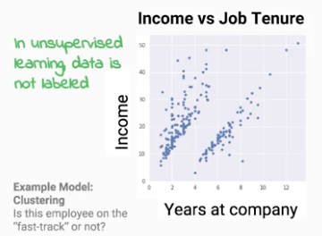
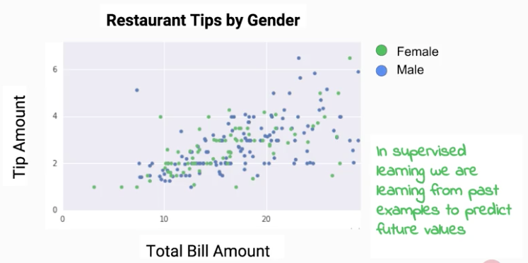
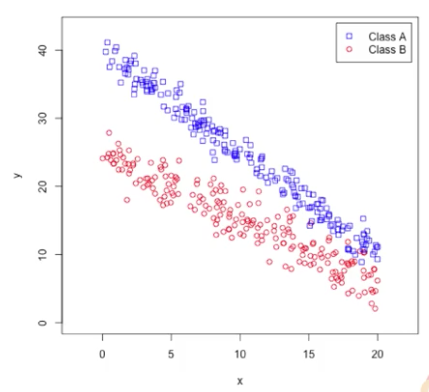
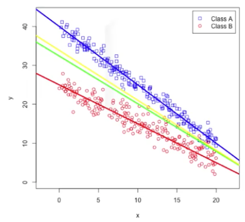

# Launching into Machine Learning

* 2019 구글 머신러닝 스터디 잼 중급반 필수 강좌 중 하나인 coursera 강좌를 정리한 글입니다.
* [링크](https://www.coursera.org/learn/launching-machine-learning/home/welcome)

## Intro
* 강좌를 통해 배우게 될 것
    * 현재 딥러닝이 이렇게까지 인기있는 이유
    * 손실 함수와 성능 지표를 통해 모델을 평가하고 최적화 하는 방법
    * ML 에서 흔히 발생하는 문제를 해결하는 방법
    * 반복가능한 training, evaluation, test 데이터셋을 만드는 방법

## Practical ML

### Supervised Learning
* 머신러닝에서 가장 널리 알려진 두 유형의 알고리즘
    * 지도학습 (supervised learning)
    * 비지도학습 (unsupervised learning)
    * 가장 큰 차이는, 지도학습의 데이터에는 label (학습되기를 원하는 정답) 이 있다는 것
* 비지도학습
    
    
    * 예시 : 수입과 근속년수 간의 관계를 보고 빠르게 승진하는 (fast-track) 그룹을 찾는 것
    * 이처럼, 정답이 없는 데이터를 보고 자연스럽게 데이터 포인트들을 그룹짓는 방법을 발견하는 것
* 지도학습
    
    
    * 예시 ( 총 지불 금액을 보고 팁 금액 또는 성별을 예측 )
        * 회귀문제 : 팁 금액을 label 로 할 경우, 연속적인 값을 예측하기 때문에 회귀 모델 (regression, continuous label)
        * 분류문제 : 성별을 label 로 할 경우, 이산적인 값을 예측하기 때문에 분류 모델 (classification, categorical label)

* Regression & Classification
    * classification 에서는 각 카테고리로 분류될지를 결정하는 decision boundary 가 존재
    * structured data 는 feature 들과 label 이 table 의 형태로 구조화된 데이터이고
    * unstructured data 는 위와 다르게 feature 들이 잘 정의되지 않은 이미지, 비디오, 오디오 등의 데이터이다.

* 예시 데이터셋

    
    * 위 예제는 linear regression 모델과 linear classification 모델 둘다에 적합한 데이터셋이다.

    
    * 선형회귀 문제로 푸는 경우, MSE (Mean Square Error, 오차 제곱의 평균) 를 손실함수로 하여 이 값이 최소가 되는 초록색 선을 그을 수 있고,
    * 선형분류 문제로 푸는 경우, logistic regression 을 손실함수로 하여 노란색 선을 그을 수 있다. (분류가 3개 이상인 경우 Cross entropy 가 많이 사용된다)
    * 두 모델이 그리는 선이 다른 이유는, 손실함수에 따라서 오차 (정답과 예측값의 차) 에 대한 페널티의 크기가 다르기 때문이다.

### ML History : Linear Regression

### ML History : Perceptron

### ML History : Neural Networks

### ML History : Kernel Methods

### ML History : Random Forest

### ML History : Modern Neural Networks

