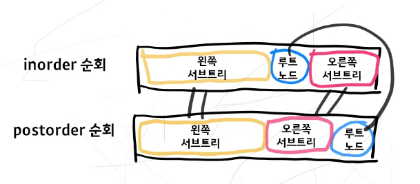

# Construct Binary Tree from Inorder and Postorder Traversal

[문제 링크](https://leetcode.com/problems/construct-binary-tree-from-inorder-and-postorder-traversal/)

---

## 문제 설명

* 이진 트리를 inorder 와 postorder 로 순회한 순서가 주어질 때, 이진 트리를 만들어야 한다.
* 트리에 중복되는 값이 없음에 주의할 것
* 예시는 문제 참고.

## 문제 풀이

* postorder 로 순회할 경우, 루트 노드를 마지막에 탐색하게 된다.
* inorder 로 순회한 순서에서는 루트 노드를 중심으로 왼쪽 서브트리의 노드들과 오른쪽 서브트리의 노드들로 나눌 수 있다.



* postorder 리스트와 inorder 리스트에서 각각 루트, 왼쪽 서브트리, 오른쪽 서브트리에 해당하는 부분을 알았으니 재귀적으로 트리를 만들어나갈 수 있다.

* list 를 계속 새로 잘라 만들어서 넘겨주는 방법
```python
class Solution:
    def buildTree(self, inorder: List[int], postorder: List[int]) -> TreeNode:
        # inorder 와 postorder 의 크기는 항상 동일해야 한다.
        if len(inorder) == 0:
            return None
        # postorder 의 마지막 원소가 순회한 트리의 루트노드이다
        mid = postorder[-1]
        head = TreeNode(mid)
        # inorder 순회 순서에서 루트노드의 위치를 찾는다
        mid_index = inorder.index(mid)
        
        # 왼쪽 서브트리에 대해 재귀적으로 트리를 만든다
        left = self.buildTree(inorder[:mid_index], postorder[:mid_index])
        # 오른쪽 서브트리에 대해 재귀적으로 트리를 만든다
        right = self.buildTree(inorder[mid_index + 1:], postorder[mid_index:-1])
        # 루트노드에 왼쪽 서브트리와 오른쪽 서브트리를 연결한다
        head.left = left
        head.right = right
        return head
```

* 리스트를 새로 만들지 않고 메모리를 절약하도록 개선
```python
class Solution:
    def buildTreeWithIndex(self, inorder: List[int], postorder: List[int], 
                           in_start: int, in_end: int, post_start:int, post_end: int) -> TreeNode:
        # inorder, postorder 리스트에서 트리로 만들 범위를 받도록 수정
        
        # start : inclusive, end : exclusive
        if in_start == in_end or post_start == post_end:
            return None
        
        mid_value = postorder[post_end - 1]
        head = TreeNode(mid_value)
        mid_index = inorder.index(mid_value)
        left_length = mid_index - in_start
        
        # in_end - in_start == post_end - post_start
        left = self.buildTreeWithIndex(inorder, postorder, in_start, mid_index, post_start, post_start + left_length)
        right = self.buildTreeWithIndex(inorder, postorder, mid_index + 1, in_end, post_start + left_length, post_end - 1)
        head.left = left
        head.right = right
        return head
    
    
    def buildTree(self, inorder: List[int], postorder: List[int]) -> TreeNode:
        return self.buildTreeWithIndex(inorder, postorder, 0, len(inorder), 0, len(postorder))
```


