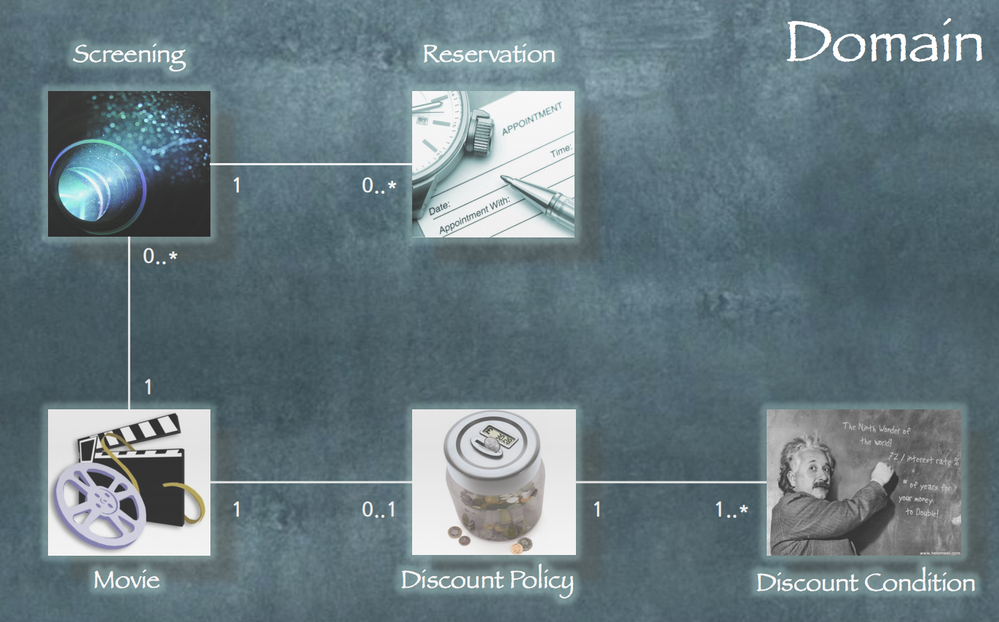
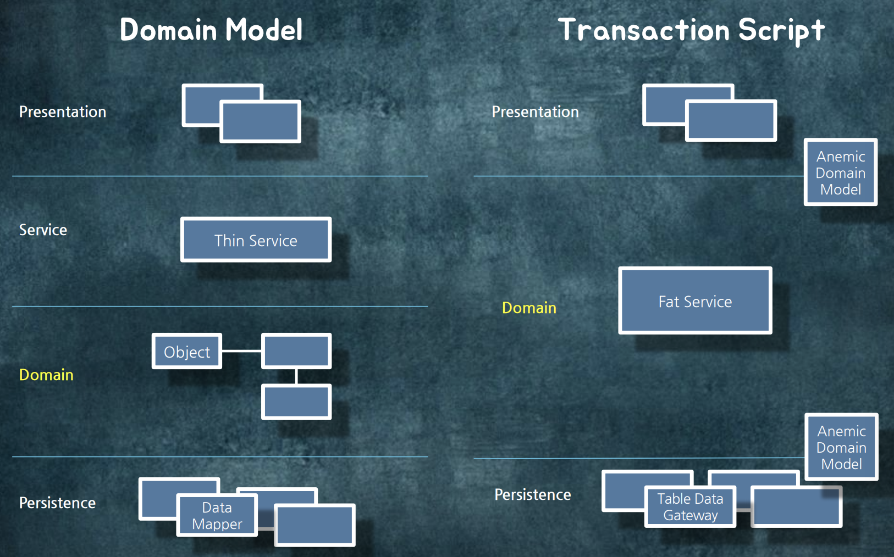

# 애플리케이션 아키텍처와 객체지향 
* 조영호님 세미나 요약

## 영화 예매 도메인
* 온라인 영화 예매 시스템

### domain concepts
* 영화
* 상영
* 할인 정책
    * amount discount policy - 절대 금액
    * percent discount policy - 비율
* 할인 조건
    * sequence condition - 회차
    * period condition - 기간
* 할인 정책 + 할인 조건
    * 영화 하나당 할인 정책은 없거나 하나 연결
    * 할인 정책당 할인 조건은 하나 이상 연결되어야 함
* 할인 적용
* 예매

### 도메인 개념 또는 후보 객체



## 레이어 아키텍처
* 나누는 방법은 많지만 일단 3개로 구성해본다
* presentation
    * ui 관련 이슈
* domain 
    * 여기에는 기술적인 이슈가 없도록 한다
    * 가장 중요한 레이어
* persistence
    * 영속성 관련 이슈

### 도메인 레이어를 설계하는 방법
* transaction script - 절차 지향
* domain model - 객체 지향

## transaction script
* 어떤 데이터가 있고, 데이터들을 이렇게 가져다 쓰자 라는 흐름으로 설계하는 방법
* data 와 process 분리
### 무엇을 저장할 것인가 - data
* 저장할 필요가 있는 것들을 가지고 데이터 모델 정의
* 이걸 가지고 하나씩 객체를 만들고, 객체의 속성들을 테이블 컬럼 하나하나에 대응시킴
* 객체의 속성에 대해 getter/setter 를 다 붙임
* 객체 - 테이블 하나당 Data Access Object 를 하나씩 다 만든다
### 어떻게 처리할 것인가 - process
* 예매 처리 스크립트 
* 보통 서비스를 하나 만들고, 처리 기능당 메소드를 하나씩 만든다
* 처리 기능에 따라 필요한 데이터를 들고오기 위해 dao 의존성을 다 추가
* dao 로 db 에서 데이터를 들고와서 절차적으로 처리 로직 구현
    * 절차적인 예매 로직 구현 예
```
1. db 에서 Movie, Screening, DiscountCondition 조회
2. Screening 에 적용할 수 있는 DiscountCondition 이 존재하는지 판단.
3. if (DiscountCondition 이 존재하면)
3.1. then - DiscountPolicy를 얻어 할인된 요금 계산
3.2. else - Movie의 정가를 이용해 요금 계산
4. Reservation 생성 후 db 저장
```
* 절차적으로 구현하게 되면 일반적으로 if 문이 많이 나오게 됨
* 중앙 집중식 제어 스타일

## domain model
* 객체지향
    * 객체 하나가 process 와 data 를 모두 들고있음 (data 와 process 를 분리하지 않음)
* 객체지향 설계의 목적
    * 협력하는 객체들의 공동체
    * 객체들이 전체적인 기능을 수행하기 위해서 서로 메시지를 주고 받으면서 처리하도록 설계해야 함

### CRC Card
* 책임과 협력을 표현하기 위한 객체지향 설계 도구
* Candidate (Role or Object)
    * 책임이 많아지면 응집도가 낮아지므로 쪼갠다
* Responsibility
* Collaborator
* 객체는 상태가 별로 중요하지 않음
    * 절차적인 구조의 경우 데이터 자체가 굉장히 중요
    * 할일을 (행위) 먼저 고민 

### 예매 생성 책임 할당
* 예매 생성에 필요한 정보의 전문가에게 할당 (Creator)
    * candidate: Screening
    * 정보 != 데이터
    * 정보를 가지고 있다고 해서 해당 데이터를 속성에 꼭 들고 있어야만 하는 것은 아니다

### 가격 계산 책임 할당
* 영화 가격 정보를 알고 있는 전문가에게 할당 (Information Expert)
    * candidate: Movie

### 할인 여부를 판단할 책임 할당
* 할인 조건을 판단하는 책임을 가진 객체 추가
    * candidate: Discount Policy

### 객체지향 구현의 예
```java
public class Screening {
    public Reservation reserve(Customer customer, int audienceCount) {
        return new Reservation(customer, this, audienceCount);
    }
}
```
* java 구현상으로 객체의 public method 가 해당 객체에 보낼 수 있는 메시지기 된다

* 위임식(delegated)/분산식(dispersed) 제어 스타일
    * 코드를 이해하기가 쉽지는 않음
    * 한번 이해하고 나면 유지보수 하기는 쉬움

## 도메인 레이어와 아키텍처
### 서비스 레이어
* presentaion 과 domain 사이에 위치
* 비즈니스 로직 구분
    * application 로직과 domain 로직으로 구분
    * application 로직은 서비스로, domain 로직은 domain 레이어로 분리
    * application 로직은 도메인 로직의 재사용성 촉진, 흔한 예는 트랜잭션
* 트랜잭션 스크립트를 사용할 때 서비스 레이어 불필요
    * 도메인 레이어에 트랜잭션 관리 + 애플리케이션 로직 + 도메인 로직 혼재
    * 응집도 떨어짐

### 퍼시스턴스 레이어와의 상호작용
* 퍼시스턴스 레이어는 일반적으로 관계형 데이터베이스
* 도메인 모델 사용시 객체-관계 임피던스 불일치
    * 객체 모델과 db 스키마 사이의 불일치
    * 객체지향으로 짜는 것을 포기하게 되는 큰 이유 중 하나
* 위 문제로 데이터 매퍼 사용
    * 객체 모델과 DB 스키마 간의 독립성 유지
    * ORM 을 사용하여 data mapper 를 구현
    * JPA - 임피던스 불일치를 해결할 수 있는 실용적인 솔루션
    * 최근에는 JPA 외에 다른 방법들도 있다고 함

### 트랜잭션 스크립트 사용시 퍼시스턴스 레이어와의 상호작용
* 테이블 데이터 게이트웨이(Table Data Gateway) 사용
    * 보통 테이블당 dao 를 하나씩 만든다
    * 단일 테이블 또는 뷰에 접속하는 SQL 처리
    * 도메인 레이어를 트랜잭션 스크립트로 구성하는 경우 사용
    * 보통 Repository 는 객체당 하나씩 생기는 개념

### 도메인 모델 vs 트랜잭션 스크립트 아키텍쳐 비교



## 아키텍쳐 선택시 고려할 점
```
우리가 짜는 프로그램은 두 가지 요구사항을 만족시켜야 한다.
우리는 오늘 완성해야 하는 기능을 구현하는 코드를 짜야 하는 
동시에 내일 쉽게 변경할 수 있는 코드를 짜야 한다.
- 샌디 메츠
```

* 그러나 내일 변경 내용에 대한 정보가 없을 수록 오늘 완성해야 하는 기능을 간결하고 명확하게 드러내는 코드를 짜는 것이 좋다.
    * 대부분 기능을 더하는 코드에 비해 기능을 삭제하도록 코드를 수정하는 것을 더 두려워 하기 때문

### Open-Closed Principle (개방-폐쇄 원칙)
* 시스템이 확장에는 열려 있고 코드 수정에는 닫혀 있어야 한다는 원칙
* 도메인 모델이 적합한 경우
```
[도메인 모델은] 복잡성을 알고리즘에서 분리하고 객체 간의 관계로
만들 수 있다.
유효성 검사, 계산, 파생 등이 포함된 복잡하고 끊임없이 변하는
비즈니스 규칙을 구현해야 한다면 객체 모델을 사용해 비즈니스 규칙을
처리하는 것이 현명하다.
- MartinFowler
```
* 프로젝트 규모가 크고 개발하는 사람들이 많아지면 보통 객체지향이 적합.
* 모든 것이 CRUD 이거나 데이터 중심적이고 DB 에 의존성이 강한 경우 절차지향적으로 짜는 것이 적합.
* 처음에는 심플하게 짜고, 요구사항이 많아지고 복잡해 질 경우 리팩토링해가면서 복잡도를 추가하는 방향으로 개발을 진행해야 함.

---

## 추가 레퍼런스
* [patterns of enterprise application architecture](https://www.amazon.com/Patterns-Enterprise-Application-Architecture-Martin/dp/0321127420)
    * transaction script - 110p
    * domain model - 116p