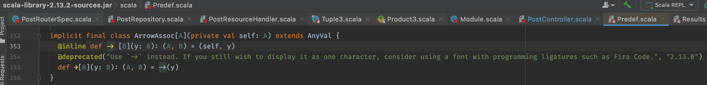
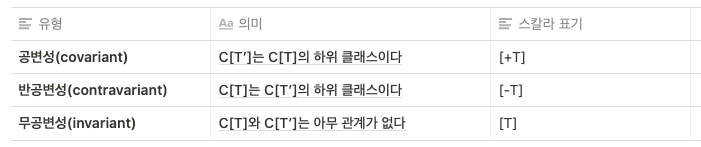

# Chapter 10 고급 타입 특징
* Learning Scala 책 10장 내용을 정리한 것입니다.

## 튜플과 함숫값 클래스

`(1, 'a')` 같은 튜플과 `(n: Int) => n * 2` 와 같은 함수 리터럴은 실제로 평범하고 오래된 클래스로 구현된다.

좋은 소식은 이러한 높은 수준의 구성체를 안전하고 타입-매개변수화 된 클래스가 뒤를 받쳐주고 있다는 것이다.

### 튜플

튜플은 `TupleX[Y]` 케이스 클래스의 인스턴스로 구현된다. 

- `X` - 1 부터 22 까지 튜플의 입력 매개변수의 개수 (arity)
    - 튜플의 항목이 23개 이상이면 에러 발생
- `Y` - `X` 개 만큼의 타입 매개변수
- `TupleX[Y]` 는 `_1` , `_2` , ... , `_X` 의 필드를 가짐
- 즉, 튜플의 표현력 있는 구문은 단순히 직접 작성했던 케이스 클래스의 바로가기일 뿐이다.
- `TupleX[Y]` 는 각각 동일한 수를 가지는 `ProductX` trait를 확장한다.
    - 이 trait 는 입력 매개변수 개수를 반환하는 `productArity` 와 n 번째 요소에 접근하는 안정적이지 않은 `productElement` (Any 타입을 반환) 같은 연산을 제공한다
    - 또한 튜플에 패턴매칭을 가능하게 하는 `unapply` 를 구현하는 동반 객체를 제공한다

```scala
scala> val x: (Int, Int) = Tuple2(10, 20)
x: (Int, Int) = (10,20)

scala> x.productArity
res3: Int = 2
```

### 함숫값

함숫값은 함수의 매개변수 개수를 기반으로 0부터 22까지 번호가 붙는 `FunctionX[Y]` 트레이트의 인스턴스로 구현된다.

```scala
scala> val hello1 = (n: String) => s"Hello, $n"
hello1: String => String = $$Lambda$1104/806609384@6e5a77ef

scala> val hello2 = new Function[String, String] { def apply(n: String) = s"Hello, $n"}
hello2: Function[String,String] = <function1>

scala> println(s"hello1 = $hello1, hello2 = $hello2")
hello1 = $line13.$read$$iw$$iw$$$Lambda$1104/806609384@6e5a77ef, hello2 = <function1>
```

- hello1 과 hello2 에 저장된 함숫값은 근본적으로 같다.
- FunctionX 클래스는 `<functionX>`  의 형태로 toString 함수를 재정의한다
- `Function1` 트레이트는 다른 FunctionX 트레이트에 없는 두 개의 특별한 메소드를 가지고 있다.
    - `andThen` - 두 함숫값으로부터 새로운 함숫값을 생성하며, 왼쪽 → 오른쪽 순서로 실행한다.
    - `compose` - `andThen` 과 반대방향으로 동작한다

```scala
scala> val doubler = (i: Int) => i * 2
doubler: Int => Int = $$Lambda$1145/2101609336@6d1c15cb

scala> val plus3 = (i: Int) => i + 3
plus3: Int => Int = $$Lambda$1146/749331034@57642552

scala> val prepend = (doubler compose plus3)(1)
prepend: Int = 8

scala> val append = (doubler andThen plus3)(1)
append: Int = 5
```

- 일급 함수가 어떻게 FunctionX 로 구현되는지 이해하는 것은 스칼라 타입 모델을 학습하는 데 있어 중요한 첫 단계다

- 추가 ) 함수 리터럴과 Function 은 타입이 같을까?
```scala
scala> hello1.getClass
res5: Class[_ <: String => String] = class $$Lambda$1104/806609384

scala> hello2.getClass
res6: Class[_ <: Function[String,String]] = class $anon$1

scala> hello1.isInstanceOf[Function[String, String]]
res7: Boolean = true

scala> hello2.isInstanceOf[String => String]
res8: Boolean = true
```

## 묵시적 매개변수

만약 매개변수를 하나도 지정하지 않고도 함수를 호출할 수 있다면?

→ 함수에 기본 매개변수를 지정하거나 누락된 매개변수에 맞는 값을 알아올 방법이 필요하다

- 묵시적 매개변수 (implicit parameter)
    - 호출자는 자신의 네임스페이스의 기본값을 제공한다.
    - 함수는 묵시적 매개변수를 다른 매개변수로부터 분리된 매개변수 그룹으로 정의할 수 있다.
    - 호출자는 지역값을 묵시적으로 표시하여 함수 호출시 이 값으로 묵시적 매개변수를 채울 수 있다.
- 키워드 `implicit`

```scala
scala> object Doubly { def print(n: Double)(implicit fmt: String) = println(fmt format n) }
defined object Doubly

scala> Doubly.print(1.23)
<console>:13: error: could not find implicit value for parameter fmt: String
       Doubly.print(1.23)

scala> Doubly.print(1.23)("%.1f")
1.2

scala> implicit val fmt = "%.2f"
fmt: String = %.2f

scala> Doubly.print(1.23)
1.23

// implicit fmt 가 이미 정의되었기 때문에 에러 발생
scala> case class USD(amount: Double) { 
   implicit val printFmt = "%.1f"
   def print = Doubly.print(amount)
 }
     |      |      | <console>:15: error: ambiguous implicit values:
 both value fmt of type => String
 and value printFmt in class USD of type => String
 match expected type String
         def print = Doubly.print(amount)

// implicit fmt 가 전역으로 정의되지 않은 상황에서는 정상동작
scala> case class USD(amount: Double) {
   implicit val printFmt = "%.1f"
   def print = Doubly.print(amount)
 }
     |      |      | defined class USD

scala> USD(1.23).print
1.2
```

- 묵시적 매개변수는 스칼라 라이브러리에서 아주 많이 사용된다.
- 묵시적 매개변수를 과하게 사용할 경우 코드가 읽고 이해하기 어려워진다.

## 묵시적 클래스

- 묵시적 클래스 (implicit class) 는 다른 클래스로부터 자동 전환을 제공하는 유형의 클래스이다
- 스칼라 컴파일러는 인스턴스에 접근하는 알려지지 않은 필드나 메소드를 발견하면 묵시적 전환을 사용한다.
    - 컴파일러는 현재의 네임스페이스에서 (1) 인스턴스를 인수로 받아 (2) 누락된 필드나 메소드를 구현하는 묵시적 전환을 찾는다.
    - 조건에 맞는 것을 발견했다면 컴파일러는 묵시적 클래스에 자동 전환을 추가하여 묵시적 타입상의 필드나 메소드의 접근을 지원한다.

```scala
scala> object IntUtils {
   implicit class Fishies(val x: Int) {
     def fishes = "Fish" * x
   }
 }
     |      |      |      | defined object IntUtils

scala> import IntUtils._
import IntUtils._

scala> println(3.fishes)
FishFishFish
```

1. 객체 내에 정의된 Fishies 는 정수를 자기자신으로 묵시적으로 변환하요
2. fishes() 메소드가 모든 정수에 대해 정의되도록 한다.
3. 이를 사용하기 전에 묵시적 클래스는 해당 네임스페이스에 추가되어야 하며
4. 그런 다음, fishes 메소드는 모든 정수에서 호출될 수 있다

- 묵시적 클래스를 사용하는데 몇가지 제약이 따른다
    1. 묵시적 클래스는 다른 객체, 클래스, 트레이트 안에 정의되어야 한다.
    2. 묵시적 클래스는 하나의 묵시적이지 않은 클래스 인수를 받아야 한다.
    3. 묵시적 클래스명은 현재 네임스페이스의 다른 객체, 클래스, 트레이트와 충돌해서는 안된다. 따라서 케이스클래스는 묵시적 클래스로 사용될 수 없는데, 자동으로 생성된 동반객체가 이 규칙에 어긋나기 때문이다.
- 엄밀히는 scala.Predef 객체 내의 묵시적 클래스는 자동으로 묵시적 전환이 된다. (자동으로 네임스페이스에 추가됨)
- 예를들어 Tuple2 를 만들기 위해 사용했던 화살표 연산자



- 묵시적 클래스는 유용한 메소드를 기존 클래스에 추가하는 훌륭한 방법이다

- implicit function
    - 스칼라 2.10 까지 묵시적 전환은 원래의 인스턴스를 받아 원하는 타입의 새로운 인스턴스를 반환하는 묵시적 def 메소드가 처리하였다.
    - 이는 기존 인스턴스를 전환하기 위해 더 안전하고 제한된 범위를 제공하는 묵시적 클래스로 대체되었다.

## 타입

- 클래스 - 데이터와 메소드를 포함하는 항목, 단일의 구체적인 정의를 가진다
    - 트레이트에 대해서도 동일하게 말할 수 있다
- 타입 - 클래스 명세서, 그 요건에 부합하는 단일 클래스 또는 여러 클래스와 일치한다.
- 객체 - 타입으로 간주하지 않고, 싱글턴이며, 타입을 확장할 수 있으나 타입 자체이지는 않다

### 타입 별칭

- type alias
- 기존의 특정 타입에 새롭게 명명한 타입을 생성
- 컴파일러는 이 새로운 타입 별칭을 일반 클래스에서 정의한 것 처럼 처리
- 객체, 클래스, 트레이트 내부에서만 정의될 수 있음
- 타입 매개변수도 받을 수 있음

```scala
scala> object TypeFun {
   type Whole = Int
   val x: Whole = 5
   
   type UserInfo = Tuple2[Int, String]
   val u: UserInfo = new UserInfo(123, "George")
 }
     |      |      |      |      |      | defined object TypeFun

scala> TypeFun.x
res0: TypeFun.Whole = 5

scala> TypeFun.u
res1: TypeFun.UserInfo = (123,George)
```

- 타입별칭은 특정 지역이름으로 기존 타입을 참조하는 유용한 방법이다.
- 그러나 다른 고급 타입 특징들처럼 타입 별칭은 신중한 객체지향 설계를 대체해서는 안된다.

### 추상타입

- abstract type
- 0, 하나, 또는 많은 클래스들로 해석할 수 있는 명세서다.
- 타입 별칭과 유사하게 동작하나, 이들은 추상적이어서 인스턴스를 생성하는 데 사용할 수 없다.
- 추상 타입은 보편적으로 전달받을 수 있는, 허용 가능한 타입의 범위를 지정하기 위해 타입 매개변수로 사용된다.
- 또한 추상클래스에서 구체적인 서브클래스가 구현해야하만 하는 타입을 선언하기 위해 사용할 수 있다.

```scala
scala> trait Factory { type A; def create: A }
defined trait Factory

scala> trait UserFactory extends Factory {
   type A = User
   def create = new User("")
 }
```

- Factory 의 추상타입 A 는 구체적인 서브클래스에서 특정 클래스의 타입 별칭으로 재정의된다.
- 이 트레이트와 클래스를 작성하는 다를 방법으로는 타입 매개변수를 사용하는 것이다.

```scala
scala> trait Factory[A] { def create: A }
defined trait Factory

scala> trait UserFactory extends Factory[User] { def create = new User("") }
defined trait UserFactory
```

- 추상 타입은 일반 클래스 (generic class) 를 설계할 때 타입 매개변수 대신 사용할 수 있다.

### 경계가 있는 타입

- bounded type
- 특정 클래스로 규정되거나 또는 그의 서브타입이나 기본타입으로 제한된다.
- 상한 경계 - 타입을 해당 타입 또는 그 서브타입 중 하나로 제한
- 하한 경계 - 타입을 해당 타입 또는 그 타입이 확장한 기본 타입 중 하나로 제한

- 예제 타입

```scala
class BaseUser(val name: String)
class Admin(name: String, val level: String) extends BaseUser(name)
class Customer(name: String) extends BaseUser(name)
class PreferredCustomer(name: String) extends Customer(name)
```

- 상한 경계를 가지는 타입
    - `<식별자> <: <상한경계타입>`

```scala
scala> def check[A <: BaseUser](u: A) { if (u.name.isEmpty) println("Fail!") }
check: [A <: BaseUser](u: A)Unit

scala> check(new Customer("Fred"))

scala> check(new Admin("", "strict"))
Fail!

scala> check(new BaseUser("test"))

scala> check("test")
<console>:13: error: inferred type arguments [String] do not conform to method check's type parameter bounds [A <: BaseUser]
       check("test")
       ^
<console>:13: error: type mismatch;
 found   : String("test")
 required: A
       check("test")
             ^
```

- 타입 매개변수 `A` 는 BaseUser 타입과 동일하거나 이를 확장한 타입만으로 제한된다
- 때문에 `name` 필드에 접근할 수 있게 해준다.
- 상한 경계 연산자의 덜 제한적인 형태로는 뷰 경계 (view-bound) 연산자 (`<%`) 가 있다
- 뷰 경계는 묵시적 전환을 할 수 있고, 상한 경계는 묵시적 전환을 고려하지 않기 때문.

- 하한 경계를 가지는 타입
    - `<식별자> >: <하한경계타입>`

```scala
scala> def recruit[A >: Customer](u: Customer): A = u match {
   case p: PreferredCustomer => new PreferredCustomer(u.name)
   case c: Customer => new Customer(u.name)
 }

scala> val customer = recruit(new Customer("Fred"))
customer: Customer = Customer@44f5259a

scala> val preferred = recruit(new PreferredCustomer("George"))
preferred: Customer = PreferredCustomer@324afa73
```

- 실제 구현체 (인스턴스) 는 더 낮을지 모르지만, Customer 타입보다 더 낮지 않은 타입을 반환하는 함수
- 새로운 `PreferredCustomer` 인스턴스가 반환될 때, 값의 타입은 반환타입으로 설정되어 `Customer` 보다 낮지 않음을 보장한다.

- 경계가 있는 타입은 추상 타입을 선언하는데 사용될 수도 있다.
- 클래스의 구현이 메소드를 구현하지만 호환 가능한 타입만 사용됨을 보장한다

```scala
scala> abstract class Card {
   type UserType <: BaseUser
   def verify(u: UserType): Boolean
 }
     |      |      | defined class Card

scala> class SecurityCard extends Card {
   type UserType = Admin
   def verify(u: Admin) = true
 }
     |      |      | defined class SecurityCard

scala> val v1 = new SecurityCard().verify(new Admin("G", "High"))
v1: Boolean = true
```

- 많은 개발자는 더 표현력이 있는 구문을 가진 타입 매개변수를 선호한다
- 대체로 경계가 있는 타입을 사용하는 것을 그렇지 않은 경우보다 선호한다

### 타입 가변성

- type variance
- 타입 매개변수가 기본타입 또는 서브타입을 만족하기 위해 조정할 수 있음을 명시
- 기본적으로 타입 매개변수는 변하지 않으며, 타입 매개변수화 된 클래스의 인스턴스는 그 클래스와 매개변수화 된 타입에만 호환된다.

---

***공변성/반공변성 (Variance)***

- Variance Question
    - T' 가 T 의 하위클래스일 때, (T' <: T) Container[T'] 가 Container[T] 의 하위 클래스인가?
    - 하위 타입 관계의 의미 - “어떤 타입 T에 대해 T’이 하위 타입이라면, T’으로 T를 대치할 수 있는가?” 하는 문제 (이를 리스코프치환원칙(Liskov Substitution Principle)이라 한다)


- 타입 매개변수 없이 - 더 낮은 타입이 더 높은 타입의 값에 저장되는 것이 허용됨

```scala
scala> class Car { override def toString = "Car()"}
defined class Car

scala> class Volvo extends Car { override def toString = "Volvo()"}
defined class Volvo

scala> val c: Car = new Volvo()
c: Car = Volvo()
```

- 동일한 다형성을 기반으로 하는 조정이 타입 매개변수에는 성립하지 않음

```scala
scala> case class Item[A](a: A) { def get: A = a }
defined class Item

scala> val c: Item[Car] = new Item[Volvo](new Volvo)
<console>:15: error: type mismatch;
 found   : Item[Volvo]
 required: Item[Car]
Note: Volvo <: Car, but class Item is invariant in type A.
You may wish to define A as +A instead. (SLS 4.5)
       val c: Item[Car] = new Item[Volvo](new Volvo)
```

- Item[Volvo] 인스턴스는 Item[Car] 의 값에 할당될 수 없다
- 기본적으로 변하지 않는 타입 매개변수는 그 매개변수가 호환되는 경우라도 다른 타입에 맞출 수 없다.

- 이를 해결하기 위해 타입 매개변수를 공변(covariant) 하게 만들어야 한다.

```scala
scala> case class Item[+A](a: A) { def get: A = a }
defined class Item

scala> val c: Item[Car] = new Item[Volvo](new Volvo)
c: Item[Car] = Item(Volvo())

scala> c.get
res0: Car = Volvo()
```

- Item.get 메소드는 비슷하게 타입 매개변수의 공변성을 지원한다.
- 인스턴스는 Item[Volvo] 이지만 그 값의 타입은 Item[Car] 이다. 따라서 c.get 의 반환타입도 Car 이다.

- 공변성은 타입 매개변수를 그 기본 타입으로 바꿔주는 훌륭한 도구이지만, 늘 적용될수 있는건 아니다.
- 메소드의 입력 매개변수는 기본타입이 서브타입으로 변환될 수 없는 것과 동일한 이유로 공변성을 가질 수 없다

```scala
scala> class Check[+A] { def check(a: A) = {} }
<console>:11: error: covariant type A occurs in contravariant position in type A of value a
       class Check[+A] { def check(a: A) = {} }
```

- 에러의 설명대로, 메소드 매개변수에 사용된 타입 매개변수는 반공변성을 띈다
- 타입 매개변수를 반공변하게 정의해보자

```scala
scala> class Check[-A] { def check(a: A) = {} }
defined class Check
```

- 공변/반공변성 예제
```scala
// Car >: Volvo >: VolvoWagon
scala> class Car; class Volvo extends Car; class VolvoWagon extends Volvo

scala> class Item[+A](a: A) { def get: A = a }
defined class Item

scala> class Check[-A] { def check(a: A) = {} }
defined class Check

scala> def item(v: Item[Volvo]) { val c: Car = v.get }
item: (v: Item[Volvo])Unit

scala> def check(v: Check[Volvo]) { v.check(new VolvoWagon()) }
item: (v: Check[Volvo])Unit

---
// Item[Car] >: Item[Volvo]
scala> item( new Item[Car]( new Car ))
<console>:15: error: type mismatch;
 found   : Item[Car]
 required: Item[Volvo]
       item( new Item[Car]( new Car ))
             ^

scala> item( new Item[Volvo]( new Volvo ) )

scala> item( new Item[VolvoWagon]( new VolvoWagon ) )

scala> check( new Check[Car] )

scala> check( new Check[Volvo] )

// Check[Volvo] <: Check[VolvoWagon]
scala> check( new Check[VolvoWagon] )
<console>:15: error: type mismatch;
 found   : Check[VolvoWagon]
 required: Check[Volvo]
       check( new Check[VolvoWagon] )
              ^
```

## 패키지 객체

- 패키지 객체 - 각 패키지의 유일한 객체로 해당 패키지의 어떤 코드의 네임스페이스에도 자동으로 임포트된다.

- 자신이 영향을 미치는 패키지에 위치한 파일 package.scala 에 정의된다.

```scala
package object oreilly {
  type Mappy[A,B] = collection, mutable.HashMap[A, B]
}
```

- 이 패키지에 정의된 어떤 클래스, 트레이트, 객체도 Mappy 타입 별칭을 가져오며, 직접 사용할 수 있다.
- 스칼라 라이브러리에서 중요한 scala 패키지는 이것과 같은 패키지 객체를 포함하며, 보편적으로 사용되는 많은 불변의 컬렉션을 네임스페이스에 추가한다.