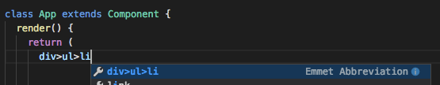

# Emmet 사용하기 

## Emmet 이란
* HTML, CSS 를 쉽고 빠르게 작성할 수 있도록 도와주는 에디터 플러그인
* https://emmet.io/
* vs code 에는 이미 emmet 이 내장되어 있어서 설치할 필요가 없다!

## JSX 코드에서도 emmet 기능 활성화하기 (vs code 사용)
* vs code 사용자 설정에 다음과 같이 jsx 언어 매핑 설정을 추가해주면 된다
```json
{
    ...
    "emmet.includeLanguages": {
        "javascript": "javascriptreact"
    }
}
```

## 기본 문법
* 사용 방법은 기본적으로 emmet 문법에 따라 약어를 입력한 후 Tab 키나 Enter 키를 입력하면 된다.

### 계층이 있는 태그 만들기
```
div>ul>li
```
위처럼 입력하면 자동완성 목록에 emmet 관련 항목도 확인할 수 있다. `>` 표시가 하위에 포함된 태그를 생성하라는 의미이다. 여기서 탭을 입력하면 자동으로 html 태그를 생성해준다.



```html
<div>
    <ul>
        <li></li>
    </ul>
</div>
```

### 병렬로 나열된 태그 만들기
병렬로 나열하는 경우 `+` 를 사용한다.
```
div+li+ul
```
```html
<div></div>
<li></li>
<ul></ul>
```

### 태그 반복해서 만들기
반복하는 경우 `*` 기호를 사용하고 반복 횟수를 써준다.
```
div>li*5
```
```html
<div>
    <li></li>
    <li></li>
    <li></li>
    <li></li>
    <li></li>
</div>
```

### class 이름 지정하기
원하는 요소 뒤에 `.` 을 찍고 class 이름을 넣으면 자동으로 클래스 이름을 입력해준다.
```
div>li.item*3
```
```html
<div>
    <li className="item"></li>
    <li className="item"></li>
    <li className="item"></li>
</div>
```

### id 지정하기
원하는 요소 뒤에 `#` 을 쓰고 아이디를 넣으면 자동으로 id 의 값으로 입력해준다.
```
div#root>li
```
```html
<div id="root">
    <li></li>
</div>
```

