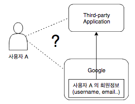
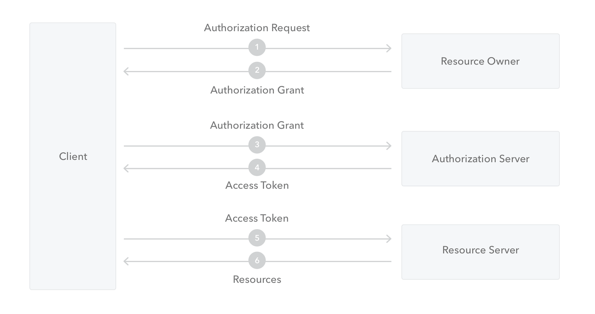

# OAuth 2.0

OAuth 2.0 은 Authorization (권한부여, 인가) 을 위한 표준 프로토콜이다.
OAuth 2.0 은 사용자가 구글이나 페이스북 같은 사이트에 있는 본인의 리소스에 대해 
서드파티 애플리케이션이 제한적으로 접근가능하도록 권한을 줄 수 있게 하는 프로토콜이다.

## 문제상황

위 그림과 같이 구글 회원인 사용자 A 가 서드파티 애플리케이션 을 이용하려고 하는 상황을 생각해보자.

만약 서드파티 앱에 직접 계정을 만든다면 아이디와 비밀번호와 같은 개인정보를 입력하고 기억하는 것 까지 번거로운 부분들이 많다.

이에 비해 구글이 가지고 있는 본인의 회원 정보를 서드파티 앱이 이용할 수 있도록 한다면 사용자 A 입장에서는 구글에 본인임을 인증하고 본인의 회원정보를 이용할 수 있도록 확인 과정만 거친다면 비교적 간단하게 서드파티 앱을 이용할 수 있다. 이 과정을 표준 프로토콜로 만든 것이 OAuth 2.0 이다

## OAuth Roles
### Resource Owner 
보호되는 자원에 대한 접근 권한을 주는 주체로, 보통 웹서비스를 실제로 사용하는 사용자 (end-user) 이다.
보호되는 자원은 보통 해당 사용자에 대한 개인정보 (email, profile) 등을 말한다.
### Resource Server
보호되는 자원에 대한 정보를 호스팅하고 있는 서버를 말한다. 
이를테면 사용자에 대한 개인정보를 요청할 수 있는 API 를 제공하는 서버이다.
### Client
Resource Owner 를 대신해서 보호되는 자원에 대한 권한을 요청하는 앱이다.
위 문제상황에서는 서드파티 앱이다.
### Authorization Server
Resource Owner 본인임을 인증하고, 적절한 권한부여 확인 과정을 거친 후 Access Token 을 발급해주는 서버이다.
구글, 페이스북 등 로그인 기능을 제공하여 유저 본인임을 확인해 줄 수 있고, 여러 서드파티 앱에 대한 권한 관리를 해줄 수 있는 웹서비스라고 할 수 있다.

## Protocol Flow

- 출처 : https://auth0.com/docs/protocols/oauth2

1. 애플리케이션 (Client) 가 리소스에 접근하기 위해 Resource Owner (사용자) 에게 authorization (권한부여, 인가) 를 요청한다.
2. 사용자가 인가를 하면, 애플리케이션은 사용자가 인가를 했음을 나타내는 credential(증명) 인 `Authorization Grant` 를 받는다.
3. 애플리케이션은 Authorization Server 에 인증하고, Authorization Grant 를 전달하여 Access Token 을 요청한다.
4. 애플리케이션이 성공적으로 인증되고, Authorization Grant 도 유효할 경우, Authorization Server 는 애플리케이션에게 Access Token 을 발급해준다.
5. 애플리케이션은 Access Token 으로 Resource Server 에 인증하여, 제한된 자원에 대한 접근을 요청한다.
6. Access Token 이 유효한 경우, Resource Server 는 요청받은 자원을 제공해준다.

## 서비스에 OAuth 2.0 붙이기
* TODO

## 공식 레퍼런스
- https://oauth.net/2/
- [Oauth 2.0 Framework - RFC 6749](https://tools.ietf.org/html/rfc6749)

## 참고 레퍼런스
- https://auth0.com/docs/protocols/oauth2
- https://dba-presents.com/index.php/other/my-thoughts/125-what-is-openid-oauth2-and-google-sign-in