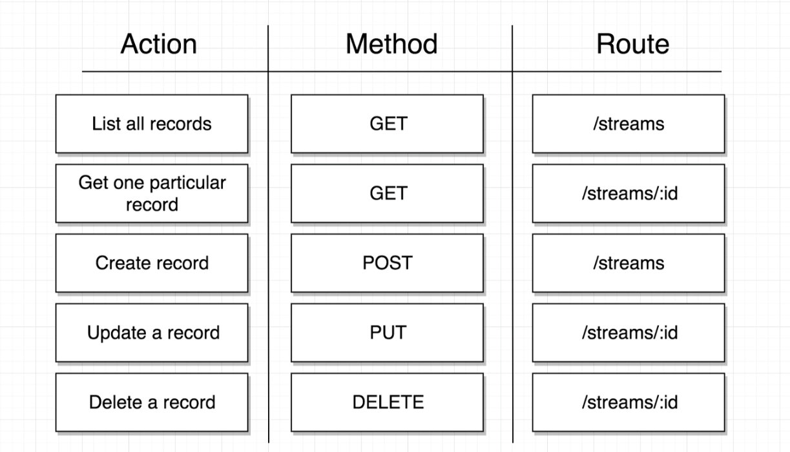

# Modern React with Redux

본 문서는 Udemy의 [Modern React with Redux 강좌](https://www.udemy.com/react-redux/) 를 듣고 내용을 정리한 것이다.

---

## 01 Let's Dive In!

### Codepen 으로 React 코드 맛보기
[예제 Codepen gist](https://gist.github.com/yeomii/4aad9c1ff1c1024a07687ec57e06a154)

### React 란?
* React 는 Javascript library 이다.
* React 의 목적은 HTML 컨텐츠를 브라우저를 통해 유저에게 보여주고, 유저와의 상호작용을 처리하는 것이다.
* React 의 component 는 javascript 의 function 또는 class 를 통해 만들 수 있다.
* JSX 는 HTML 과 유사하며, js 코드 내에 위치할 수 있다. HTML 처럼 react app 의 컨텐츠를 나타내는 js `syntax extension` 이다.
* React 라이브러리는 component 를 정의하고 여러 component 가 함께 동작할 수 있도록 한다.
* ReactDOM 라이브러리는 DOM 내에서 component 가 보여지도록 하는데 책임이 있다.

### React Project 만들기
* 진행 순서
    * node js 설치 > create-react-app 설치 > 프로젝트 생성 > 프로젝트 빌드
#### node js 설치
```sh
# node 설치 여부 확인
$ node -v 
```
* 버전이 낮거나 설치되어있지 않다면 [링크](https://nodejs.org/en/download/)에서 최신 버전을 받아 설치한다.
* 여러 버전의 노드를 설치하고 싶은 경우 아래와 같이 nvm 을 사용하여 설치할 수도 있다.
```sh
# nvm 설치 https://github.com/creationix/nvm
$ curl -o- https://raw.githubusercontent.com/creationix/nvm/v0.34.0/install.sh | bash
# 설치 가능한 lts node 버전 리스트업
$ nvm ls-remote --lts
# latest lts 버전 노드 설치
$ nvm install --lts
# 설치 성공했는지 버전 확인
$ node -v 
# 노드 버전이 여러개라면 원하는 버전을 기본으로 지정해준다
$ nvm alias default v10.15.3
```
#### create-react-app 설치
```sh
# global 하게 create-react-app 패키지 설치
$ npm install -g create-react-app
```
#### 프로젝트 생성 및 빌드
* 프로젝트 생성
```sh
# first-react-app 이라는 이름으로 새 프로젝트 생성
$ create-react-app first-react-app
# create-react-app 을 설치하지 않고 npx 를 사용할 수도 있다.
$ npx create-react-app first-react-app
```
* 프로젝트 빌드
```sh
$ cd first-react-app
$ npm start
```

### react 와 babel
* js 버전 변화
    * ES5 > ES2015 > ES2016 > ... > ES2019
* ES5 버전은 모든 브라우저에 호환성이 있는 반면, ES2015 버전은 거의 대부분의 브라우저에 호환성이 있고, ES2016 이후의 버전은 브라우저 호환성이 좋지 않다.
* babel 은 js 컴파일러로, ES2015 이상의 버전으로 작성된 js 코드를 현재 또는 오래된 브라우저가 이해할 수 있는 js 코드로 변환해준다.

### 프로젝트 구조 
* src/
    * 실제로 작성할 코드가 들어가는 폴더
* public/
    * 이미지와 같은 정적 파일이 들어가는 폴더
* node_modules/
    * 프로젝트 의존성이 들어가는 폴더
* package.json
    * 프로젝트 의존성을 설정하고 기록하는 파일
* package-lock.json
    * 설치된 패키지의 정확한 버전을 기록하는 파일
* README.md

### index.js 시작하기
@ src/index.js 
```js
// Import React and ReactDOM libraries
import React from 'react';
import ReactDOM from 'react-dom';

// Create a react component
const App = () => {
    return <div>Hi there!</div>;
}

// Take the react component and show it on the screen
ReactDOM.render(
    <App />,
    document.querySelector('#root')
);
```

#### import vs require
* js 에서 라이브러리를 import 할 때, import 또는 require 키워드를 사용한다.
```js
// ES2015 Module
import React from 'react';
// CommonJS Module
const React = require('react');
```

#### React Component
* js 의 function 또는 class 로 작성할 수 있다.
* JSX 를 사용해서 HTML 을 생성하여 유저에게 보여줄 수 있다.
* event handler 를 사용해서 유저로부터 피드백을 받아올 수 있다.

---

## 02 Building Content with JSX

### JSX 란?
* jsx 는 html 로 보이지만 브라우저가 이해할 수 있는 언어가 아니다.
* jsx 는 유저 브라우저에서 직접 해석되지 않고 babel 을 통해 ES5 js 로 변환된다.
* [babel 웹페이지](https://babeljs.io/repl) 에서 어떻게 변환되는지 확인할 수 있다.
    * react 코드
    ```jsx
    const App = () => {
        return <div>Hi there!</div>;
    }
    ```
    * ES5 로 변환된 js 코드
    ```js
    var App = function App() {
    return React.createElement("div", null, "Hi there!");
    };
    ```

### JSX vs HTML
* element 에 style 을 적용할 때 다른 문법을 사용해야 한다
    * HTML
    ```html
    <div style="background-color: red;"></div>
    ```
    * JSX
    ```jsx
    // 바깥 {} 괄호는 js 변수를 참조한다는 표현이고, 안쪽 {} 괄호는 js object 를 표현한다.
    <div style={{backgroundColor: 'red'}}></div>
    ```
* element 에 class 를 추가할 떄 다른 문법을 사용해야 한다
    * HTML
    ```html
    <div class="root"></div>
    ```
    * JSX
    ```jsx
    // class (element attribute) 대신 className 을 사용해야 한다
    // class 는 es2015 부터 js 키워드로 사용되기 때문
    <div className="root"></div>
    ```
* JSX 는 js 변수 또는 함수를 참조할 수 있다
    * HTML
    ```html
    <label>hello</label>
    ```
    * JSX
    ```jsx
    // class (element attribute) 대신 className 을 사용해야 한다
    // class 는 es2015 부터 js 키워드로 사용되기 때문```
    const text = 'hello';
    <label>{text}</label>
    ```
    * string 이 와야하는 곳에는 js object 를 참조할 수 없다

---

## 03 Props

* Component 를 작성할 때 신경써야 할 것
    * Nesting
    * Reusability
    * Configuration

### semantic-ui
* 오픈소스 css framework
* 자세한 설명은 TODO

* 간단히 시작하기
```html
<html>
    <head>
        ...
        <link rel="stylesheet" href="https://cdnjs.cloudflare.com/ajax/libs/semantic-ui/2.4.1/semantic.min.css" />
    </head>
    ...
</head>
```

### faker.js
* 테스트용으로 필요한 가짜 데이터를 자동으로 생성해주는 오픈소스 js 라이브러리

* 간단히 시작하기
```sh
# react 프로젝트에 faker 라이브러리 설치
$ npm install --save faker
```
```jsx
import faker from 'faker';
...
const App = () => { return ; }
...
```

### Reusable, Configurable 한 컴포넌트 만들기
* 중복되는 JSX 코드를 찾는다
* 해당 JSX 블럭의 목적에 맞게 이름을 짓는다
* 새로운 컴포넌트가 들어갈 새로운 파일을 만든다. 이 때 파일이름은 컴포넌트와 동일해야 한다.
* 새로 만든 파일에 컴포넌트를 새로 만들고 JSX 코드를 옮긴다
* react 의 props 시스템을 사용해서 컴포넌트를 configurable 하게 만든다.

* 예제
    * before
    ```js
    // index.js
    import React from 'react';
    import ReactDOM from 'react-dom';
    import faker from 'faker';

    const App = () => {
        return (
            <div className="ui container comments">
                <div className="comment">
                    <a href="/" className="avatar">
                        
                    </a>
                    <div className="content">
                        <a href="/" className="author">
                            Sam
                        </a>
                        <div className="metadata">
                            <span className="date">Today at 06:00PM</span>
                        </div>
                        <div className="text">Nice!</div>
                    </div>
                </div>
            </div>
        );
    };

    ReactDOM.render(<App />, document.querySelector('#root'));
    ```

    * after
    ```jsx
    // @index.js
    import React from 'react';
    import ReactDOM from 'react-dom';
    import faker from 'faker';
    import CommentDetail from './CommentDetail';

    const FakeCommentDetail = () => {
        return <CommentDetail 
            author={faker.name.firstName()} 
            dttm={faker.date.recent().toString()}
            avatar={faker.image.avatar()}
            comment={faker.lorem.sentence()}
        />
    };

    const App = () => {
        return (
            <div className="ui container comments">
                <FakeCommentDetail />
                <FakeCommentDetail />
            </div>
        );
    };

    ReactDOM.render(<App />, document.querySelector('#root'));

    // @CommentDetail.js
    import React from 'react';

    const CommentDetail = props => {
        return (
            <div className="comment">
                <a href="/" className="avatar">
                    
                </a>
                <div className="content">
                    <a href="/" className="author"> {props.author} </a>
                    <div className="metadata">
                        <span className="date">{props.dttm}</span>
                    </div>
                    <div className="text">{props.comment}</div>
                </div>
            </div>
        );
    }

    export default CommentDetail;
    ```

### props
* 부모 컴포넌트에서 자식 컴포넌트로 데이터를 넘기기 위한 시스템
* 자식 컴포넌트를 설정하거나 커스텀하기 위한 목적으로 사용

* 부모 컴포넌트에서 자식 컴포넌트로 데이터를 넘기려면 jsx 태그에 attribute 로 달아주면 된다
* 자식 컴포넌트에서 데이터를 참조하려면 props 를 인자로 받아서 부모 컴포넌트에서 넣어준대로 키밸류로 참조할 수 있다.
* props 로 데이터를 전달하는 방법
    * 부모 컴포넌트에서 jsx 태그의 attribute 로 데이터를 넘기는 방법 ( props.{keyName} )
    ```jsx
        // 부모 컴포넌트
        <Comment comment="Nice!" />
        // 자식 컴포넌트
        const Comment = props => { return <div> {props.author} </div> };
    ```
    * 부모 컴포넌트의 jsx 태그 내용에 자식 컴포넌트의 jsx 태그를 쓰는 방법 ( props.children )
    ```jsx
        // 부모 컴포넌트
        <Card>
            <Comment/>
        </Card>
        // 자식 컴포넌트 
        const Card = props => { return <div> {props.children} </div>}
    ```

---

## 04 Structuring Apps with Class-Based Components

### 클래스 기반 Component
* 이전까지 베웠던 function 기반 Component 는 html 을 표현할 수 있었지만 유저와의 상호작용은 처리하지 못했다
* Functional Component
    * 로직이 없는 단순한 컨텐츠를 보여주기에 적합
* Class Component
    * 나머지 모든 경우에 적합
    * 보통은 읽기 편한 코드를 작성할 수 있음
    * state 를 사용할 수 있음 -> 사용자 입력을 다루기 편함
    * lifecycle event 를 알고 있음 -> 앱이 시작할 때 해야할 작업을 정의하기 편함

### Geolocation API 사용하기
* https://developer.mozilla.org/ko/docs/WebAPI/Using_geolocation
* 유저의 현재 위치 가져오기
```js
window.navigator.geolocation.getCurrentPosition(
    (position) => console.log(position), // onSuccess
    (e) => console.log(e)  // onFailure
);
```

### Functional Component 를 사용하면 어려운점
* Geolocation API 를 호출해서 사용자 위치를 표시하는 앱을 생각해보면 아래와 같은 순서대로 타임라인이 구성된다.
    * 브라우저에 의해 js file 들이 로딩된다.
    * App component 들이 생성된다.
    * Geolocation API 를 호출해서 데이터를 요청한다.
    * App 이 jsx 를 리턴하고, jsx 가 브라우저에서 렌더링된다.
    * 요청한 데이터가 도착한다.
* 페이지 렌더링이 다 끝난 후 요청한 데이터가 도착하기 때문에 사용자 위치를 나중에 표시해주기가 어렵다.

### Class Component 규칙
* js class (since es2015) 여야 한다
* React.Component 의 자식클래스여야 한다.
* 표현할 jsx 를 반환하는 render 함수를 정의해야 한다.


---

## 05 State in React Component

### State 규칙
* class component 에서만 사용할수 있다.
* props 와 state 는 혼동하기 쉬운 개념이므로 주의하자.
* `state` 는 특정 component 에 관련된 데이터를 담고있는 js object 이다.
* state 를 업데이트하면 거의 대부분은 `render` 함수를 통해서 컴포넌트를 다시 렌더링하게 된다.
* state 는 컴포넌트가 생성될 때 초기화되어야 한다.
* state 는 `setState` 함수를 통해서만 업데이트 되어야 한다.

### Class Component + state 예제
```jsx
import React from 'react';
import ReactDOM from 'react-dom';

class App extends React.Component {
    constructor(props) {
        super(props);
        this.state = { lat: null, long: null, errorMessage: ''};

        window.navigator.geolocation.getCurrentPosition(
            (position) => { this.setState({ lat: position.coords.latitude, long: position.coords.longitude }); },
            (e) => { this.setState({errorMessage: e.message}); }
        );
    }

    render() {
        if (this.state.errorMessage && !this.state.lat) {
            return <div>Error: {this.state.errorMessage}</div>;
        }

        if (!this.state.errorMessage && this.state.lat) {
            return <div>Latitude: {this.state.lat}, Latitude: {this.state.long}</div>;
        }

        return <div>Loading...</div>;
    }
}

ReactDOM.render(<App />, document.querySelector('#root'));
```

---

## 06 Understanding Lifecycle Methods

### component lifecycle methods
* class 기반 component 에서 정의할 수 있는 함수로, 이 함수를 구현할 경우 해당 component 의 lifecycle 의 특정 시점에 react 에 의해 자동으로 호출된다.

#### 함수 호출 순서
* constructor
* render 
    * 스크린에 내용이 보이기 시작함
* componentDidMount
    * 특정 위치에 계속 존재, update 를 기다림 (setState 로 업데이트)
* componentDidUpdate
    * 특정 위치에 계속 존재, 더이상 보이지 않는 상태가 될 때까지 기다림
* componentWillUnmount

#### best practice
* constructor
    * 딱 한번 해야하는 초기화 작업 정의
* render
    * jsx 반환 외에는 다른 작업을 하지 않는 것을 권장
* componentDidMount
    * 데이터 로딩 정의에 적합
* componentDidUpdate
    * state / props 가 바뀌었을때 해주어야할 데이터 로딩 정의에 적합
* componentWillUnmount
    * cleanup 시 해주어야 할 작업 정의
* 위 함수 외에도 여러 lifecycle method 가 존재

### constructor 외에 다른 방법으로 state 초기화 하기
* constructor 사용
```jsx
class App extends React.Component {
    constructor(props) {
        super(props);
        this.state = { lat: null, long: null, errorMessage: ''};
    }
    ...
}
```

* class 본문에 초기화 내용 정의 (babel 이 자동으로 변환해준다)
```jsx
class App extends React.Component {    
    state = { lat: null, long: null, errorMessage: '' };
    ...
}
```

### props 기본값 정의
* `||` 연산자 사용
```jsx
const Spinner = (props) => {
    return <div>{props.message || 'loading...'} </div>;
}
```
* 또는 defaultProps 사용
```jsx
const Spinner = (props) => return <div>{props.message} </div>;

Spinner.defaultProps = {
    message: 'loading...'
};
```

---

## 07 Handling User Input with Forms and Events

### input 태그로 사용자 입력 받기
* onChange 콜백 등록
```jsx
class SearchBar extends React.Component {

    onInputChange(event) {
        console.log(event.target.value);
        // do something with the input event...
    }

    render() {
        return (
            <form action="">
                <input type="text" onChange={this.onInputChange}/>
            </form>
        );
    }
}
```

### Controlled vs Uncontrolled Component
* HTML element 가 유저 입력과 같은 변하는 데이터를 들고 있는지 여부가 중요
    * component 의 state 내에 데이터를 들고 있으면 Controlled Component 라 하고,
    * DOM 내 HTML element 의 attribute 내에 데이터를 들고있으면 Uncontrolled Component 이다.

### Controlled Component 로 만들기
* 사용자 입력 데이터는 항상 SearchBar 컴포넌트 내의 state.term 에 저장된다.
```jsx
class SearchBar extends React.Component {
    state = { term : '' };

    render() {
        return (
            <form>
                <input type="text" value={this.state.term} onChange={(e) => this.setState({term : e.target.value})}/>
            </form>
        );
    }
}
```

### 입력 폼의 기본 동작 덮어쓰기
* onSubmit 이벤트 핸들러에서 event.preventDefault 함수 호출
```jsx
class SearchBar extends React.Component {
    onFormSubmit(event) {
        event.preventDefault();
    }

    render() {
        return (
            <form onSubmit={this.onFormSubmit}  action="">
                <input type="text" />
            </form>
        );
    }
}
```

### js 의 this 이해하기
* 아래 코드에서 onSubmit 핸들러가 호출되면 `console.log` 부분에서 에러가 발생한다.

```jsx
class SearchBar extends React.Component {
    onFormSubmit(event) {
        event.preventDefault();
        console.log(this.state);
    }

    render() {
        return (
            <form onSubmit={this.onFormSubmit}  action="">
                <input type="text" />
            </form>
        );
    }
}
```
* 결론 먼저 정리하면 `this` 가 `SearchBar` 클래스의 인스턴스가 아닌 `undefined` 이기 때문이다.


* 함수 내에서 this 가 실제로 가리키는 값은 함수가 어디에 정의됐느냐에 결정되기 보다 어디에서 호출됐는지에 따라 결정된다.
* 아래 예제를 살펴보면 car.drive 와 truck.driveTruck, driveNone 은 Car 클래스에 정의된 drive 함수를 가리킨다.
* 떄문에 반환하는 값이 `'car'` 로 같을 것으로 예상할 수 있지만 `truck.driveTruck` 의 값은 `'truck'` 이 된다.
* `driveNone` 은 위 예제와 같이 에러가 발생한다.
```js
class Car {
	setDriveSound(sound) {
    this.sound = sound;
  }
  drive() {
    return this.sound;
  }
}
const car = new Car();
car.setDriveSound('car');
car.drive(); // car

const truck = {
	sound: 'truck',
    driveTruck: car.drive
};
truck.driveTruck() // truck

const driveNone = car.drive;
driveNone(); // TypeError: Cannot read property 'sound' of undefined
```

* SearchBar 에서 발생하는 에러를 고치는 방법은 여러가지가 있다.
    * constructor 에서 함수를 binding 하는 방법
    ```jsx
    class SearchBar extends React.Component {
        constructor(props) {
            super(props);
            this.onFormSubmit = this.onFormSubmit.bind(this);
        }
        ...
    }
    ```
    * arrow function 을 사용하는 방법 
        * arrow function 이 자동으로 함수 내부의 this 를 bind 해준대
    ```jsx
    class SearchBar extends React.Component {
        onFormSubmit = (event) => {
        event.preventDefault();
        console.log(this.state.term);
        }
        ...
    }
    ```
    * jsx 태그 내에서 arrow function 을 사용하는 방법
    ```jsx
    class SearchBar extends React.Component {
        render() {
            return (
                <form onSubmit={() => this.onFormSubmit}  action="">
                    <input type="text" />
                </form>
            );
        }
        ...
    }
    ```

### 부모 컴포넌트에게 이벤트 전달하기
* jsx 태그에 onClick 이나 onSubmit 이벤트 핸들러를 등록했던 것과 비슷하게, 
  부모의 콜백을 자식 컴포넌트가 호출할 수 있도록 잘 전달하고 등록하면 된다.
* 아래 예제는 부모 컴포넌트인 App 의 onSearchSubmit 을 SearchBar 의 콜백으로 전달하여 이벤트를 전달받는 예제이다.

```jsx
class App extends React.Component {
    onSearchSubmit(term) {
        console.log(term);
    }

    render() {
        return (
            <div className="ui container">
                <SearchBar onSubmit={this.onSearchSubmit} />
            </div>
        );
    }
}

class SearchBar extends React.Component {
    onFormSubmit = (event) => {
        event.preventDefault();
        // console.log(this.state.term);
        this.props.onSubmit(this.state.term);
    }
    ...
}
```

---

## 08 Making API Requests with React

* [unsplash](https://unsplash.com/developers)
    * 고퀄리티 이미지 API 제공

### network request 를 위해 사용하는 library 들
* axios
    * 3rd party package
* fetch
    * 최신 브라우저에 내장된 함수
    * axios 를 사용하는 것 보다 더 많은 코드를 작성해야 할 것

### axios 사용하기
* 패키지 설치
```sh
$ npm install --save axios
```

* API 요청 날리기
```jsx
import React from 'react';
import axios from 'axios';

class App extends React.Component {
    onSearchSubmit(term) {
        axios.get('https://api.unsplash.com/search/photos', {
            params: { query: term },
            headers: { Authorization: 'Client-ID ...' }
        });
    }
    ...
}
```

* axios 를 사용한 위 요청은 시간이 소요되는 비동기 요청이므로 호출한 위치에서 응답 값을 바로 사용할 수 없다.
* axios 는 get 이나 post 와 같은 함수 호출로 네트워크 요청을 하면 그 반환값으로 promise 를 준다.
    * promise 란 시간이 걸리는 어떤 작업이 끝나고 난 후 알림을 주는 object 이다.
* promise 의 then function 으로 API 요청에 callback 을 등록할 수 있다.
```jsx
axios.get('https://api.unsplash.com/search/photos', {
    params: { query: term },
    headers: { Authorization: 'Client-ID ...' }
}).then(response => {
    // callback
    console.log(response.data);
})
```

### Async Await 를 사용해서 요청 처리하기
* 함수 앞에 async 키워드를 붙이면 비동기 요청의 응답을 await 로 기다릴 수 있다.
```jsx
async onSearchSubmit(term) {
    const response = await axios.get('https://api.unsplash.com/search/photos', {
        params: { query: term },
        headers: { Authorization: 'Client-ID ...' }
    });
    console.log(response.data.results);
}
```

### 기본 설정을 분리해서 axios 기반 custom client 만들기
* @ api/unsplash.js
    * 기본 설정을 기반으로 axios 객체를 만들어서 export
```jsx
import axios from 'axios';

export default axios.create({
    baseURL: 'https://api.unsplash.com/',
    headers: {
        Authorization: 'Client-ID Access-key'
    }
});
```
* @ components/App.js
    * axios 대신 unsplash 를 import
```jsx
import unsplash from '../api/unsplash';

class App extends React.Component {
    onSearchSubmit = async (term) => {
        const response = await unsplash.get('/search/photos', {
            params: { query: term }
        });
    }
    ...
}
```

---

## 09 Building Lists of Records

### List 를 렌더링할 때 key attribute 의 의미
* 아래 jsx 를 렌더링하면 key 속성이 없다는 워닝이 발생한다
    * jsx 예제
    ```jsx
    import React from 'react';

    const ImageList = (props) => {
        const images = props.images.map(image => { return ; });
        return <div>{images}</div>;
    };
    ```
    * warning
    ```
    Warning: Each child in a list should have a unique "key" prop.
    ```
* 위 예제는 img 태그를 아래처럼 고쳐주면 해결이 된다.
```jsx
 
```
* key를 정의해야하는 이유는 리스트의 일부 데이터만 갱신되었을 경우 새로 렌더링할 필요가 있는 아이템만 효율적으로 렌더링하게 하기 위함이다.


---

## 10 Using Ref's for DOM Access
* react component 가 render 된 후에 DOM element 의 attribute 값을 변경해줄 필요가 있을 때, Ref 로 DOM 에 접근할 수 있다.
* React.createRef 로 ref object 를 만들고, jsx 태그의 ref 속성 안에 달아준다.

```jsx
class ImageCard extends React.Component {
    constructor(props) {
        super(props);
        this.imageRef = React.createRef();
    }

    componentDidMount() {
        this.imageRef.current.addEventListener('load', (e) => { console.log(e)});
    }

    render() {
        const {urls, description} = this.props.image;
        return (
            
        );
    }
}
```

---

## 12 On We Go .. To Redux!
* Redux는 state 를 관리하는 라이브러리다.
* React 와 독립적으로 쓸 수 있다.

### Redux Cycle
* Action Creator > Action > dispatch > Reducers > State

### Redux 사용하기
* reducer 를 정의하고, Redux.combineReducers 로 reducer 합성한다.
* 합성한 reducer 를 인자로해서 Redux.createStore 함수로 state store 를 만든다.
* store.dispatch 함수 호출로 reducer 가 인식할 수 있는 action 을 전달한다.
* action 은 type 과 payload 로 구성된다.
* store.getState 함수를 호출해서 action 으로 인해 변경된 state 를 가져온다.

```js
// action
const createPolicy = () => {
  return {
    type: 'CREATE_POLICY',
    payload: { name: 'Alex',amount: 20 }
  };
};
// action
const deletePolicy = () => {
  return {
    type: 'DELETE_POLICY',
    payload: { name: name }
  };
};
// action
const createClaim = (name, amountOfMoneyToCollect) => {
  return {
    type: 'CREATE_CLAIM',
    payload: { name: name, amountOfMoneyToCollect: amountOfMoneyToCollect }
  };
};
// reducer
const claimsHistory = (oldListOfClaims = [], action) => {
  if (action.type === 'CREATE_CLAIM') {
    return [...oldListOfClaims, action.payload];
  }
  return oldListOfClaims;
}
// reducer
const accounting = (bagOfMoney = 0, action) => {
  if (action.type === 'CREATE_CLAIM') {
    return bagOfMoney - action.payload.amountOfMoneyToCollect;
  } else if (action.type === 'CREATE_POLICY') {
    return bagOfMoney + action.payload.amount;
  }
  return bagOfMoney;
}
// reducer
const policies = (listOfPolicies = [], action) => {
  if (action.type === 'CREATE_POLICY') {
    return [...listOfPolicies, action.payload.name];
  } else if (action.type === 'DELETE_POLICY') {
    return listOfPolicies.filter(name => name !== action.payload.name);
  }
  return listOfPolicies;
}

import Redux from 'redux';

const {createStore, combineReducers} = Redux;
// combining reducers
const ourDepartments = combineReducers({
  accounting: accounting,
  claimsHistory: claimsHistory,
  policies: policies
});
// creating store with combined reducer
const store = createStore(ourDepartments);
// make action and dispatch to make changes as reducer defines
const action = createPolicy('Alex', 20);
store.dispatch(action);
// get changed state
console.log(store.getState());
```

---

## 13 Integrating React with Redux

* React-Redux 라이브러리
    * React 와 Redux 는 독립적인 라이브러리이지만, 같이 사용하려면 React-Redux 라이브러리도 사용하는 것이 좋다
* redux, react-redux 설치
```sh
$ npm install --save redux react-redux
```
* 프로젝트 구조
```
/src
    /actions        # action 생성과 관련된 코드 포함
    /components     # react component 코드 포함
    /reducers       # reducer 관련 코드 포함
    index.js
```

* React-Redux 적용하기
```jsx
// @ index.js
import React from 'react';
import ReactDOM from 'react-dom';
import { Provider } from 'react-redux';
import { createStore } from 'redux';

import App from './components/App';
import reducers from './reducers';

// Provider 태그를 최상위에 두고 store 속성에 store 를 생성해서 넣어준다
ReactDOM.render(
    <Provider store={createStore(reducers)}>
        <App />
    </Provider>
    , document.querySelector('#root')
);
/////////////////////////////////////////////////////

// @ components/SongList.js
import React, { Component } from 'react';
import { connect } from 'react-redux';
// selectSong 은 action 을 반환하는 함수이다
import { selectSong } from '../actions';

class SongList extends Component {
    render() {
        return (
            <div>
                {this.props.songs}
                <button onClick={() => this.props.selectSong(song)}>Select</button>
            </div>
        );
    }
}
const mapStateToProps = (state) => {
    // 반환되는 object 는 props 로 사용될것이다
    return { songs: state.songs, seletedSong: state.selectedSong };
};
// connect 함수로 store 와 연결해준다.
export default connect(mapStateToProps, { selectSong })(SongList);
```

* Provider 와 connect 를 사용하는 것이 키포인트
    * provider 는 공통의 state 를 사용할 수 있도록 저장소를 만들어주는 역할을 하고
    * connect 는 각 component 에서 공통의 state 가 변경될 때 마다 특정 값을 가져다 쓸 수 있도록 콜백함수를 연결해 줄 수 있도록 한다.
    * 또한 connect 는 공통의 state 를 변경할 수 있도록 action 을 생성하는 함수를 각 컴포넌트의 props 에 연결해준다.

* 버튼으로 증감시키는 Counter 예제
```jsx
import React from 'react';
import ReactDOM from 'react-dom';
import { Provider, connect } from 'react-redux';
import { createStore, combineReducers } from 'redux';

// Action creator
const increment = () => ({ type: 'increment' });
const decrement = () => ({ type: 'decrement' });

// react component
const Counter = (props) => {
    return (
        <div>
            <button className="increment" onClick={props.increment}>Increment</button>
            <button className="decrement" onClick={props.decrement}>Decrement</button>
            Current Count: <span>{props.count}</span>
        </div>
    );
};

// 공통의 state 값 중 count 값을 props 에 매핑
const mapsToProps = (state) => {
    return { count: state.count };
}
// state 변경시 값을 받아오는 함수와 state 를 직접 변경할 수 있도록 action 을 생성하는 함수를 Counter 라는 컴포넌트에 바인딩
const WrappedCounter = connect(mapsToProps, {increment, decrement})(Counter);

// action 을 받을 때 어떻게 state 를 변경할지 정의한 reducer 들을 모아서 공통의 state 저장소를 생성
const store = createStore(combineReducers({
    count: (count = 0, action) => {
        if (action.type === 'increment') {
            return count + 1;
        } else if (action.type === 'decrement') {
            return count - 1;
        } else {
            return count;
        }
    }
}));

// html 로 렌더링
ReactDOM.render(
    <Provider store={store}>
        <WrappedCounter />
    </Provider>, 
    document.querySelector('#root')
);
```

---

## 14 Async Actions with Redux Thunk

* [JsonPlaceholder (fake json data maker)](https://jsonplaceholder.typicode.com/)

### redux-thunk
* 설치
```sh
$ npm install --save redux-thunk
```
* redux-thunk
    * redux application 에서 요청을 날릴 수 있도록 도와주는 middleware

### Redux 의 일반적인 데이터 로딩
* component 가 브라우저에 렌더링됨
* componentDidMount lifecycle 함수가 호출됨
* `componentDidMount` 함수에서 액션을 생성하는 함수를 호출
* 액션을 생성하는 함수는 API 요청을 날림
* API 응답 데이터를 받음
* 액션을 생성하는 함수가 응답된 데이터를 받아서 payload 프로퍼티에 설정한 action 오브젝트를 반환
* reducer 함수에서 action 을 보고 payload 의 데이터를 state 로 반환
* 새 state object 를 보고 redux/react-redux 라이브러리가 react app 을 다시 렌더링함

### Redux 와 async action
* 일반적인 action creator 안에서 비동기 함수를 호출한 후 응답을 기다릴 수 없다.
    ```jsx
    import axios from 'axios';

    export const fetchPosts = async () => {
        const url = 'https://jsonplaceholder.typicode.com/posts';
        const response = await axios.get(url);
        return {
            type: 'FETCH_POSTS',
            payload: response
        };
    };
    ```
    * 위 코드를 connect 로 component 에 연결하여 호출하게 되면 아래와 같은 에러메시지가 출력된다.
    ```
    Error: Actions must be plain objects. Use custom middleware for async actions.
    ```
    * action creator 는 plain js object 를 반환해야한다
        * async await 코드가 ES2015 로 변환되면서 `jsonPlaceholder.get` 호출의 결과를 먼저 반환하게 된다
    * async await 를 사용하지 않고 promise 를 payload 로 반환하게 되더라도 reducer 에 의해 action object 가 처리되는 시점에 데이터가 도착하지 않았을수도 있기 떄문에 문제가 생긴다.
* 비동기 함수를 호출하는 action creator 를 만들 경우 middleware 를 사용해야 한다.

* redux 의 middleware
    * 모든 action 에 대해 호출되는 함수
    * 액션을 중단시키거나 수정할 수 있다
    * 비동기 액션을 처리하기 위해 많이 사용된다
    * 본 강좌에서는 비동기 액션 처리를 위해 redux-thunk 라이브러리를 사용한다.

* redux-thunk 의 action creator 는
    * action object 를 반환하거나
    * 함수를 반환할 수 있다

### redux-thunk 사용하기
* redux-thunk 는 함수를 반환하는 action creator 에게 dispatch, getState 함수를 전달해서 action creator 가 원하는 타이밍에 해당 함수를 호출할 수 있도록 한다.
* 비동기 호출을 하는 action creator 는 비동기 호출이 완료되었을 때 dispatch 로 action 을 redux store 에 전달해준다.
```jsx
// @ index.js

import React from 'react';
import ReactDOM from 'react-dom';
import { Provider } from 'react-redux';
import { createStore, applyMiddleware } from 'redux';
// thunk import
import thunk from 'redux-thunk';

import App from './components/App';
import reducers from './reducers';

// store 를 생성할 때 thunk 미들웨어를 적용해준다.
const store = createStore(reducers, applyMiddleware(thunk));

ReactDOM.render(
    <Provider store={store}>
        <App />
    </Provider>,
    document.querySelector('#root')
);

// @ actions/index.js
import axios from 'axios';

export const fetchPosts = () => {
    // dispatch, getState 함수를 인자로 받는 함수를 반환한다
    return async function (dispatch, getState) {
        const url = 'https://jsonplaceholder.typicode.com/posts';
        const response = await axios.get(url);        
        dispatch({ type: 'FETCH_POSTS', payload: response });
    }
};
```

---

## 15 Redux Store design

### Reducer 의 규칙
* undefined 를 반환하면 안된다
* 이전 state 또는 action 만을 사용하여 state 를 만들어야 한다.
* 자신 외의 다른 값에 접근하면 안된다.
* input 으로 들어오는 state 값을 변형하여 반환하지 않을것을 권장한다.
    * array 동치 연산 (`===`) 의 경우 array 의 주소가 같은지 아닌지만 보고 확인한다.
    * redux 의 경우 이전 state 와 현재 state 가 다른지를 `===` 연산자로 비교하기 때문에 이전 state 의 array 에 값을 추가하거나 제거하여 반환하면 state 가 바뀐것을 인식하지 못할 수 있다.

### 동일한 요청을 여러번 날려야 하는 문제 해결하기
* `_.memoize` 사용하기
    * https://lodash.com/docs/4.17.11#memoize
    * 설치
    ```sh
    $ npm install --save lodash
    ```
    * 사용
    ```jsx
    import _ from 'lodash';
    
    // memoize 가 _fetchUser 함수의 호출 결과를 기억
    const _fetchUser = _.memoize(async (id, dispatch) => {
        const url = 'https://jsonplaceholder.typicode.com/posts';
        const response = await axios.get(`${url}/users/${id}`);
        dispatch({ type: 'FETCH_USER', payload: response.data });
    });

    export const fetchUser = id => dispatch => _fetchUser(id, dispatch);
    ```
* 미리 unique 한 요청들을 모아놓은 후 해당 리스트에 대해서만 순서대로 요청을 날린다
    * 예제
    ```jsx
    import _ from 'lodash';

    export const fetchPosts = () => async dispatch => { .. };
    export const fetchUser = id => async dispatch =>  { ... };

    // action creator 안에서 action creator 를 호출하는 것도 가능
    // action creator 호출 후 변경된 state 는 getState 함수로 접근할 수 있다
    export const fetchPostsAndUsers = () => async (dispatch, getState) => {
        await dispatch(fetchPosts());

        const ids = _.uniq(getState().posts.map(post => post.userId));
        ids.forEach(id => dispatch(fetchUser(id)));
    }
    ```

---

## 16 Navigation with React Router

* 하나의 웹앱 내에서 서로 다른 페이지로 이동하기 위해 react-router 라이브러리를 사용할 수 있다

### React Router 사용하기
* 설치
```sh
$ npm install --save react-router-dom
```
* 가장 간단한 예제
    ```jsx
    import React from 'react';
    import { BrowserRouter, Route } from 'react-router-dom';

    const PageOne = () => { return <div>Page 1</div>; }
    const PageTwo = () => { return <div>Page 2</div>; }

    const App = () => {
        return (
            <div>
                <BrowserRouter>
                        <Route path="/" exact component={PageOne} />
                        <Route path="/p2" exact component={PageTwo} />
                </BrowserRouter>
            </div>
        );
    };
    ```

* 앱 내에서 anchor 를 쓰지 않고 Link 태그를 쓰도록 한다
    * `<a href="/p2">page two</a>` 와 같이 a 태그를 써서 내비게이션 하게 되면 서버는 항상 html 페이지를 새로 내려준다. 
    * 대신 react-router-dom 의 Link 컴포넌트를 사용하도록 한다
    ```jsx
    <Link to="/p2>page two</Link>
    ```
    * 브라우저에서 렌더링 될 때는 Link 태그가 a 태그로 변환된다
    * Router 밖에서 Link 태그를 사용하는 경우는 에러가 나므로 주의!

### Router 의 종류
* 배포 문제 때문에 라우터 종류를 나누게 되었다
* BrowserRouter
    * `localhost:3000/page`
    * TLD (top level domain) 또는 포트 뒤에 있는 모든 것이 path
* HashRouter
    * `localhost:3000/#/page`
    * # 뒤에 나오는 모든 것이 path
* MemoryRouter
    * `localhost:3000/`
    * page navigation 하는데 url 을 사용하지 않음

---

## 17 Handling Authentication with React

### OAuth-Based Authentication
* 사용자는 외부 서비스 제공자 (구글, 페이스북 등) 를 통해 인증 (authentication) 하고
* 우리가 작성한 애플리케이션이 사용자의 정보에 접근할 수 있도록 사용자가 권한을 부여 (authorization) 해준다
* https://developers.google.com/identity/protocols/OAuth2

### OAuth for Servers vs Browser Apps
* OAuth for Servers
    * 주로 사용자가 로그인한 상태가 아닐 때에도 사용자의 정보에 접근할 필요가 있을 때 사용 (주기적으로 실행되어야 하는 애플리케이션 등)
    * 사용자의 많은 정보를 저장해야 해서 초기 셋업이 어려움
* OAuth for Browser Apps
    * 주로 사용자가 로그인한 상태에서만 사용자의 정보에 접근
    * 구글의 경우 js library 의 도움을 받을 수 있어 사용하기 쉬움

### Google OAuth2 API 사용하기
* [구글 API 콘솔](https://console.developers.google.com)에서 새 프로젝트를 만든다
* 새로 생성한 프로젝트를 선택한 후, Credentials (사용자 인증정보) 탭에서 사용자 인증정보를 만들기를 선택하고 OAuth 클라이언트 ID 를 생성한다.
* OAuth 클라이언트 ID 를 생성할 때, Authorized JS origins 값은 `http://localhost:3000` 과 같이 클라이언트 앱의 원본 URI 를 입력한다.
* html head 태그 안에 아래와 같이 작성해서 oauth 라이브러리를 불러온다.
    ```html
        <script src="https://apis.google.com/js/api.js"></script>
    ```
    * html 페이지를 로딩했을 때 크롬 개발자 콘솔에서 gapi 가 정의되어 있는 것을 확인할 수 있다.
* gapi 를 사용해 oauth2 클라이언트를 로딩해주고 클라이언트 id 와 scope 를 주어 초기화 해준다.
    * [gapi 문서](https://developers.google.com/api-client-library/javascript/reference/referencedocs) 의 `gapi.auth2` 참고
    ```jsx
    class GoogleAuth extends React.Component {
        componentDidMount() {
            window.gapi.load('client:auth2', () => {
                // load callback
                window.gapi.client.init({
                    clientId: '{client id}',
                    scope: 'email'
                }).then(() => {
                    this.auth = window.gapi.auth2.getAuthInstance();
                    this.setState({ isSignedIn: this.auth.isSignedIn.get() });
                    this.auth.isSignedIn.listen(this.onAuthChange);
                });
            });
        }
        ...
    }
    ```

---

## 18 Redux Dev Tools

### [redux-devtools-extension](https://github.com/zalmoxisus/redux-devtools-extension)
- Redux 를 사용해서 개발할 때 디버깅하는데 도움이 되는 chrome extension 
- Readme 의 Installation 섹션을 따라 설치하자
    - middleware 도 사용할거라면 [`1.2 Advanced store setup`](https://github.com/zalmoxisus/redux-devtools-extension#12-advanced-store-setup) 도 적용하자
- action history 와 action 에 따른 state 변화를 확인할 수 있다

### Redux debug session
* `http://localhost:3000/?debug_session=<session_name>`
    * 위 url 로 react-redux 앱에 접속하면 redux-devtool 은 디버그 세션을 시작한다.
    * 디버그 세션에서는 페이지를 새로고침해도 redux store 에 있는 모든 데이터가 그대로 유지된다.

---

## 19 Handling Forms with Redux Form

* 기존의 방식대로 form 을 사용할 경우
    * input element 의 onChange 등의 리스너 함수에 setState 를 호출하는 콜백을 등록하고
    * state 값이 업데이트 될 때마다 input element 의 value 값을 업데이트 하도록 컴포넌트를 구성해야 한다
* redux form 을 사용하면 
    * input element 의 값을 redux store 로 가져오기 쉽도록 해준다 (redux from reducer)

### [Redux Form](redux-form.com) 으로 Form 만들기
* 설치 
```sh
$ npm install --save redux-form
```
* [Redux form examples](https://redux-form.com/8.2.0/examples/) 페이지에서 원하는 종류의 form 을 선택한다
* reducer 를 만들 때 `redux-form` 으로부터 reducer 를 받아와 combinReducers 의 인자로 넣어준다
    ```jsx
    @ reducers/index.js
    import { combineReducers } from 'redux';
    import { reducer as formReducer } from 'redux-form';

    export default combineReducers({
        form : formReducer
    });
    ```
* redux form component 를 만들때 reduxForm 메서드와 Field 컴포넌트를 이용하면 된다
    ```jsx 
    import React from 'react';
    import { Field, reduxForm } from 'redux-form';

    class StreamCreate extends React.Component {
        renderInput(formProps) {
            // onChange={formProps.input.onChange} value={formProps.input.value} 로 매핑
            return (
                <div className="field">
                    <label>{formProps.label}</label>
                    <input {...formProps.input} />
                </div>
            );
        }

        render() {
            return (
                <form >
                    <Field name="title" component={this.renderInput} label="Enter Title"/>
                    <Field name="description" component={this.renderInput} label="Enter Description"/>
                </form>
            );
        }
    }

    export default reduxForm({
        form: 'streamCreate'
    })(StreamCreate);
    ```
    * Field 는 여러 종류의 input 이 될 수 있다
* form 을 submit 할 때는 redux-form 에서 제공하는 `handleSubmit` 을 component 의 콜백함수와 함께 호출한다.
    ```jsx 
    onSubmit(formValues) {
        console.log(formValues);
    }
    
    render () {
        return (
            <form className="ui form" onSubmit={this.props.handleSubmit(this.onSubmit)}>
                <Field name="title" component={this.renderInput} label="Enter Title"/>
                <button className="ui button primary">Submit</button>
            </form>
        );
    }
    ```
* form 입력값을 validation 하려면 validate 함수를 정의한 후 reduxForm 의 validate 인자로 넘겨주면 된다
    ```jsx
    @ component
    const validate = (formValues) => {
        const errors = {};
        if (!formValues.title) {
            errors.title = 'Enter Title';
        }
        if (!formValues.description) {
            errors.description = 'Enter Description';
        }
        return errors;
    }

    export default reduxForm({
        form: 'streamCreate',
        validate
    })(StreamCreate);
    ```
    * validate 함수의 결과는 Field 컴포넌트의 component 에서 `formProps.meta.error` 로 접근할 수 있다 (위 예제에서 renderInput 함수)

---

## 20 REST-Based Apps

### REST Convention
* API 디자인을 위한 표준화된 시스템


### json-server 패키지
* https://www.npmjs.com/package/json-server
* 개발용으로 쉽게 api 서버를 만들 수 있는 패키지
* 설치
  ```sh
  $ npm init
  $ npm install --save json-server
  ```
* 서버 응답을 정의하기 위해 `db.json` 파일을 만들고 아래와 같이 응답을 정의해준다
  ```json
  ```
* package.json 부분에 아래와 같이 적어주면 `npm start` 로 시작할 수 있다
  ```json
  {
      ...
      "scripts": {
        "start": "json-server -p 3001 --watch db.json"
      },
      ...
  }
  ```
* 주의) 기존 데이터에서 변경사항만 반영하고 싶을 때에는 `PUT` 대신 `PATCH` 메소드를 사용하자

### Intentional Navigation vs Programmatic Navigation
* Intentional Navigation
    * 사용자가 `Link` 컴포넌트를 클릭해 페이지를 이동하는 경우
* Programmatic Navgation
    * 앱에서 강제로 다른 페이지로 이동하게 하는 경우

### react-router 를 이용해서 Programmatic Navgation 구현하기
* history object 를 만들고 Router 컴포넌트에 에 연결
    ```jsx
    @ history.js
    import { createBrowserHistory } from 'history'; 
    export default createBrowserHistory();

    @ App.js
    const App = () => {
    return (
        <div className="ui container">
            <Router history={history}>
            ...
            </Router>
        </div>
        );
    };
    ```
* 원하는 시점에 `history.push(path)` 를 호출
    ```jsx
    export const createStream = formValues => async (dispatch, getState) => {
        const { userId } = getState().auth;
        const response = await streams.post('/streams', { ...formValues, userId });
        dispatch({type: CREATE_STREAM,payload: response.data});
        history.push('/');
    };
    ```
